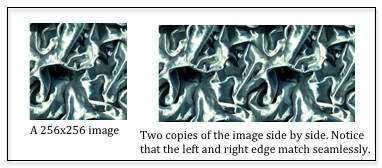
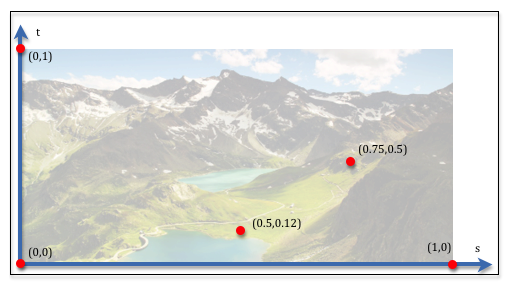
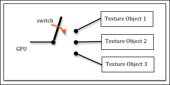

# Texture Mapping Using Images

## Hardware Overview

## Software Overview

纹理映射将 2D 图像中的位置映射到 3D 三角形上的位置。WebGL 使用 `texture coordinates` 来执行映射。
与图形的许多其他方面一样，纹理坐标是百分比。纹理坐标使用 (s, t)符号来表示图像中的位置。s 分量是图像宽度的百分比，而 t 分量是图像高度的百分比。
每个模型顶点都被分配了一个纹理坐标，这些坐标在三角形的表面上进行插值，为每个三角形片段指定图像中的唯一位置。

创建纹理映射的基本步骤如下：
1. 构建模型时：
    1. 为纹理映射选择合适的图像。
    2. 为三角形的每个顶点分配适当的纹理坐标 (s,t)。
2. JavaScript 预处理画布渲染：
    1. 从服务器下载纹理贴图图像。
    2. 创建 GPU `texture object`，并使用图像进行填充。
    3. 设置控制纹理贴图图像使用方式的参数。
    4. 从 `shader program` 程序中获取 `uniform Sample2D` 变量的位置。
3. 每次使用纹理贴图渲染模型时的 JavaScript 设置：
    1. 将 `texture object` 绑定到 `texture unit`
    2. 将 `texture unit` 绑定到 `uniform shader variable`.
4. `Shader program`
    1. In the `vertex shader`, creating a varying variable that will interpolate the texture coordinates across the surface of a triangle.
    2. In the `fragment shader`, use the texture coordinates to lookup a color from the texture image.
    
如你所见，与纹理映射相关的问题有很多，因此我们将按照上面列出的顺序一次讨论一个。

### 1a. Select an Appropriate Image

任何数字图像都可以用作纹理贴图，但是如果图像的宽和高不是2的幂，图像的使用方式会收到限制。最好使图像的尺寸是2的幂，这使得纹理映射更有效，并消除了对其使用的任何限制。
因此，图像的每个维度应该是 1、2、4、8、16、32、64、128、256、512、1024 或 2048 像素。某些设备支持更高的分辨率，但你应该使图像尽可能小以节省下载时间并节省 CPU 和 GPU 内存。
你应该尝试使图像分辨率与画布上绘制渲染的对象的像素大小大致相同。

很多图像编辑器允许你修改图像的精度，如果你不希望图片被扭曲，你必须考虑图像的纵横比——即它的宽度与高度的关系。通常，您应该裁剪 `crop` 图像以获得所需的内容并使纵横比为 1/1、1/2、1/4、1/8 等。当你拥有图像的内容并且综合比正确，将图像的分辨率（以像素为单位）更改为 2 的幂。

一些纹理贴图图像被设计为平铺 `tiled`，这意味着可以将单个图像放在其自身的旁边，而看不到它们连接的部分。



右边缘与左边缘（以及顶部边缘到底部边缘）相互匹配的图像在设计和创建方面非常重要。

Thankfully there are many sites on the internet that give away free images that can be tiled. Just do an search for “free texture map images that can be tiled”. Here is some sites that offer royalty free images for texture mapping:
* http://www.textures.com/
* http://www.mayang.com/textures/
* http://www.rendertextures.com/

纹理映射图像中的颜色可以使用 RGB 或 RGBA 颜色表示。如果你不关心透明度，则应该使用RGB颜色，这样可以节省内存。如果你想使图片的部分内容透明（因为你想使用图像表现非矩形区域），那么你必须使用 RGBA 颜色并且要将隐藏的每个像素的 alpha 分量设置为零。这需要更复杂的图像编辑器，例如 Adob​​e Photoshop 或其开源软件 GIMP。

### 1b. 纹理坐标（Texture Coordinates）

分配给模型每个顶点的纹理坐标控制着图像颜色到三角形面的映射。纹理坐标的概念很容易理解,但是将纹理坐标分配给单个顶点的任务可能很复杂。我们将在这里介绍这个概念，下一课将简要讨论如何使用 Blender 分配纹理坐标。



纹理坐标是表示图像中某个位置的两个分数。第一个分数称为 `s`，是距图像左侧的百分比。第二个分数称为 `t`，是距图像底部的百分比。(WebGL 中图像的坐标系的原点在左下角，+S 轴向右，+T 轴向上。)

### 2a. 从服务器下载纹理图像（Download Texture Images from the Server）

在 OBJ 模型定义中，纹理贴图图像的文件名存储在分配给模型的材料属性中。

When you export a model that contains a texture map from Blender, the file name for a texture map image is stored as a `map_Kd` property of a material defined in the MTL file associated with the OBJ file. (Note that Kd is the diffuse property of the material. Therefore, the texture map image is expected to be used for the diffuse color of locations on a triangle’s surface.) 

> 当你从 Blender 导出包含纹理贴图的模型时，纹理贴图图像的文件名存储在与 OBJ 文件关联的 MTL 文件中定义的材质的 map_Kd 属性中。（请注意，Kd 是材质的漫反射属性。因此，这个纹理贴图图像被希望用于三角形表面上位置的漫反射颜色。）

纹理贴图图像文件必须被下载，并将其存储在 GPU 纹理对象 `texture object` 中，然后在渲染模型时由着色器程序 `shader program` 使用。


要注意的是，图像有多种数据格式，例如 `gif`、`png` 和 `jpeg`。Web 浏览器了解如何读取和解释所有标准图像编码。当您创建 JavaScript Image 对象并指定图像的 src（源）时，浏览器不仅会下载图像，还会对其进行正确解码。您不必担心任何图像解码问题！

### 2b. 在 GPU 中创建纹理对象（Create Texture Objects in the GPU）

当我们渲染一个模型，我们希望这个模型数据存储在GPU的内存中，它可以被 `shader program` 直接访问。要象使用颜色查询表那样使用图像，我们还需要可以从 GPU 的内存访问该图像。
因为纹理映射与 `gl.drawArrays()` 相比，是根本不同的操作，存储纹理映射图像的内存称为纹理对象 `texture object` 而不是缓冲区对象 `buffer object` 。
纹理对象 `texture object` 保存着一个图像和所有进行纹理映射时所需的相关状态变量。你可以在GPU内存允许的情况下，创建尽可能多的纹理对象 `texture object`。

创建纹理对象有三个基本步骤：
1. Create a new texture object
2. Set the parameters that control how the texture object is used.
3. Copy an image into the texture object

以下函数创建一个纹理对象。请阅读并研究每个命令之前的注释。

```javascript
/**
 * Create and initialize a texture object
 * @param my_image Image A JavaScript Image object that contains the
 *                       texture map image.
 * @returns {WebGLTexture} A "texture object"
 * @private
 */
function _createTexture(my_image) {

  // Create a new "texture object"
  var texture_object = gl.createTexture();

  // Make the "texture object" be the active texture object. Only the
  // active object can be modified or used. This also declares that the
  // texture object will hold a texture of type gl.TEXTURE_2D. The type
  // of the texture, gl.TEXTURE_2D, can't be changed after this initialization.
  gl.bindTexture(gl.TEXTURE_2D, texture_object);

  // Set parameters of the texture object. We will set other properties
  // of the texture map as we develop more sophisticated texture maps.
  gl.texParameteri(gl.TEXTURE_2D, gl.TEXTURE_MIN_FILTER, gl.LINEAR);

  // Tell gl to flip the orientation of the image on the Y axis. Most
  // images have their origin in the upper-left corner. WebGL expects
  // the origin of an image to be in the lower-left corner.
  gl.pixelStorei(gl.UNPACK_FLIP_Y_WEBGL, 1);

  // Store in the image in the GPU's texture object
  gl.texImage2D(gl.TEXTURE_2D, 0, gl.RGB, gl.RGB, gl.UNSIGNED_BYTE, my_image);

  return texture_object;
}
```

`binding to an object` 不是现代编程语言的一部分，值得详细解释。请记住，WebGL 是硬件图形引擎的 API（应用程序编程接口）。在编程时，如果想着它是个硬件，那么会容易得多。
想象一下，一个 GPU 有许多纹理对象，你希望硬件让其中一个成为它的“活动”纹理对象。从概念上讲，GPU 必须连接到纹理对象。在硬件中，连接事物的方式是通过拨动开关。
因此，当您“绑定一个对象”时，在概念上是“拨动开关”以连接硬件中的组件。



上面的每个 gl 命令都有很多细节——我们无法在这个概述中涵盖太多细节。我们将在后面的课程中再讨论这些命令的一些细节。

### 2c. 纹理参数（Texture Parameters）

纹理贴图图像的精度很少与要渲染的3D三角形精度相同。例如，一个纹理贴图图像可能是128 X 128个像素，而要使用这个贴图的三角形可能只覆盖了渲染画布的20个像素。这是个巨大的差异，而且也会出现相反的情况。要渲染的三角形可能覆盖渲染图像中的 100,000 个像素。这意味着必须放大 `to be enlarged` 或缩小 `shrunk ` 纹理贴图图像以匹配 3D 三角形的大小。

WebGL 使用术语“放大” `magnification` 和“缩小” `minification` 来表示这些想法，您可以控制如何“放大”和“缩小”。您可以在速度或质量之间做出选择，但您不能两者兼得。
选项名称基于相关算法的工作方式而不是结果：`gl.NEAREST` 选择距离某个位置最近的像素并为你提供速度。
而 gl.LINEAR 计算围绕某个位置的四个像素的加权平均值，这会产生更好的颜色，但会减慢渲染速度。
以下示例代码将生成最佳质量的图形，但渲染速度较慢。

```
gl.texParameteri(gl.TEXTURE_2D, gl.TEXTURE_MIN_FILTER, gl.LINEAR);
gl.texParameteri(gl.TEXTURE_2D, gl.TEXTURE_MAG_FILTER, gl.LINEAR);
```

纹理坐标是介于 0.0 和 1.0 之间的百分比值。如果纹理坐标超出此范围，WebGL 应该怎么做？你有三个选择：
* `gl.REPEAT` : 使用百分比的小数部分作为纹理坐标。例如，值 2.75 将变为 0.75。它适用于在大面积上重复纹理贴图的效果。这就是“平铺”的方式。一个相同的纹理贴图图像在更大的区域内被重复使用。
* `gl.CLAMP_TO_EDGE` : 将所有大于 1.0 的值限制为 1.0，并将所有小于 0.0 的值限制为 0.0。因此，如果纹理坐标超出 0.0 到 1.0 的范围，则会重复使用图像边界处的颜色。是一种视觉检查无效纹理坐标时使用的好方法，但它的视觉用途非常有限。
* `gl.MIRRORED_REPEAT` : 将反转坐标的小数部分。例如，1.25 将映射到 0.75，因为 1.0 - 0.25 = 0.75。效果是将其边缘的图像进行镜像。这使得原始图像和镜像图像间的接缝“消失”。

可以为纹理贴图的 s 轴和 t 轴设置不同的这些参数，例如：

```
gl.texParameteri(gl.TEXTURE_2D, gl.TEXTURE_WRAP_S, gl.REPEAT);
gl.texParameteri(gl.TEXTURE_2D, gl.TEXTURE_WRAP_T, gl.MIRRORED_REPEAT);
```

最后的预处理步骤是获取着色器程序中将访问纹理贴图的变量的位置。它是一个类型为 `Uniform Sampler2D` 的变量。我们通常将这个变量的位置添加到着色器程序对象中，如下所示：

```
program.u_Sampler = gl.getUniformLocation(program, "u_Sampler");
```

## JavaScript Setup for Texture Mapping

你的着色器程序 `shader program` 将包含其片段着色器中的一个 `uniform Sampler2D` 变量。此变量必须指定用于纹理映射的纹理单元 `texture unit`。但是纹理单元需要来自纹理对象的数据。
因此，我们将纹理对象绑定到纹理单元，然后将 `uniform Sampler2D` 变量设置为纹理单元。如下所示:

```javascript
// Make the "texture unit" 0 be the active texture unit.
gl.activeTexture(gl.TEXTURE0);

// Make the texture_object be the active texture. This binds the
// texture_object to "texture unit" 0.
gl.bindTexture(gl.TEXTURE_2D, texture_object);

// Tell the shader program to use "texture unit" 0
gl.uniform1i(program.u_Sampler, 0);
```

这三个命令可能会非常混乱，因为它们使用不同的方式来指定纹理单元。
当您激活纹理​​单元时，您必须使用枚举类型 (ENUM) 值：gl.TEXTURE0、gl.TEXTURE1、gl.TEXTURE2 等。但是，“points to” 纹理单元的着色器变量只是一个整数，0、1、2 等。
我不确定他们为什么会产生这种不一致，但这就是它的工作原理。枚举值 gl.TEXTURE0, gl.TEXTURE1, gl.TEXTURE2等，被保证是连续的，
所以你可以使用代码 gl.TEXTURE0 + j<sup>th</sup> 来指定第 j 个纹理单元。

## 使用纹理贴图的着色器程序（Shader Programs that use Texture Mapping）

执行纹理映射的着色器程序是整个过程中最简单的部分。顶点着色器 `vertex shader` 简单的将顶点的纹理坐标拷贝到一个 `varying` 变量中，然后它们可以在三角形的表面上进行插值。
如下是一个顶点着色器的例子：

```javascript
// Vertex Shader
precision mediump int;
precision mediump float;

// Scene transformation
uniform mat4 u_PVM_transform; // Projection, view, model transform

// Original model data
attribute vec3 a_Vertex;
attribute vec2 a_Texture_coordinate;

// Data (to be interpolated) that is passed on to the fragment shader
varying vec2 v_Texture_coordinate;

void main() {

  // Pass the vertex's texture coordinate to the fragment shader.
  v_Texture_coordinate = a_Texture_coordinate;

  // Transform the location of the vertex for the rest of the graphics pipeline
  gl_Position = u_PVM_transform * vec4(a_Vertex, 1.0);
}
```

片段着色器使用片段的纹理坐标来查找纹理贴图图像中的颜色。这是内置于 GLSL 功能中的常见操作。
你只需调用 `texture2D` 函数并指定要使用的纹理单元和纹理坐标（它是一个 `vec2`，两个浮点值）。

```javascript
// Fragment shader program
precision mediump int;
precision mediump float;

// The texture unit to use for the color lookup
uniform sampler2D u_Sampler;

// Data coming from the vertex shader
varying vec2 v_Texture_coordinate;

void main() {

  gl_FragColor = texture2D(u_Sampler, v_Texture_coordinate);
}
```

## 例子

* WebGL_simple_texture_image

[下一篇](./texture_coordinates.md)