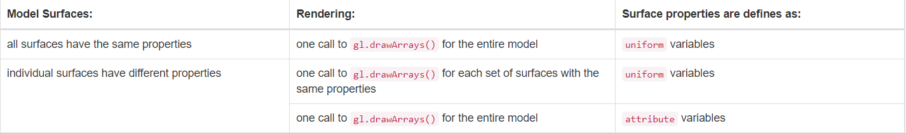
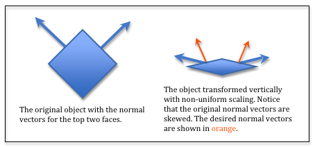
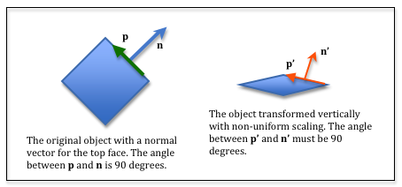
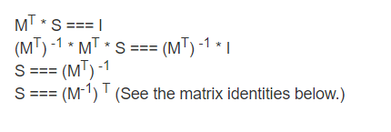
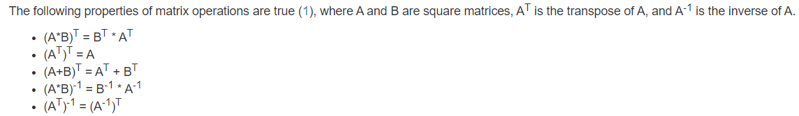

# Introduction to Surface Properties

你得眼睛能看到物体，是因为光线从物体上反射到你的眼睛。表面的属性影像光线从物体反射的方式。

## Overview of Lessons
在之前的课程里，我们学习了如何对光及其表面反射进行建模。Wasn’t it amazing how much better the renderings looked when the color of the pixels was based on reflected light! 然而，我们使用单一颜色来表示模型的外观，这使得模型的渲染过于统一和“纯粹”。真实世界的物体其表面有更多的变化。对模型三角形的表面属性进行建模使得我们可以在 WebGL 计算机生成的图像上实现真实感的照片渲染。（要获得精确的“照片真实感”，您必须使用光线追踪，这是一种完全不同的 3D 计算机图形图像渲染方式。）

表面属性很复杂，我们无法涵盖图形程序可能使用的所有可能的属性。但我们将介绍基础知识，即：
* 颜色(Color)：表面的颜色实际上不是单一的颜色，而是一组颜色，因为表面实际上对环境光、漫反射和镜面光反射的反应不同。
* 方向(Orientation): WebGL 只渲染三角形，但我们可以修改三角形顶点的法向量来模拟曲面。
* 材质(Texture): 一个表面可以有多种颜色。例如一件衣服。
* 平滑 vs 不平的(Smooth vs. Bumpy): 
* 明亮 vs 暗淡(Shiny vs. Dull): 在显微镜下看一个表面，可能是不规则的并且看起来“暗淡”，因为它会向各个方向反射光线，即使是镜面反射也是如此。或者在显微镜下它可能非常光滑，镜面反射的散射最小。

## Overview of Code

你的 JavaScript 代码将设置模型的表面属性，你的 GPU 片段着色器程序将使用这些属性来计算三角形每个片段的颜色。
构建表面属性描述的场景有很多。主要问题是模型的所有表面是否都具有相同的属性，或者各个表面具有不同的属性。在设计模型和实现着色器程序时，你需要考虑这些问题。
请记住，你需要权衡内存使用和渲染速度。



## 表面属性变换(Surface Property Transformations)

和之前的课程一样，我们将在“相机空间”中执行片段着色器计算，因为：
* GPU 着色器程序无需更新任何 `uniform` 变量即可知道相机的位置和方向。（相机位于全局原点并与全局轴对齐。）
* 将相机放在原点可以简化一些光线计算。

这意味着任何与模型位置或方向相关的表面属性都必须转换为“相机空间”。在大多数情况下，这很简单，但如果您的转换包含非均匀缩放，则会出现问题。
请注意，相机变换不包括缩放——仅包括旋转和平移。因此，如果您的模型转换包含非均匀缩放，则会出现问题。

### 无缩放或均匀缩放（No Scaling or Uniform Scaling）
如果您的模型转换 `model transformation` 包括平移、旋转和/或统一缩放，您可以使用模型视图 `model-view` 转换将模型的法向量转换为“相机空间”。请记住，向量没有位置，只有大小和方向。
因此，向量的齐次坐标必须为零，以便永远不会对其应用平移。向量 <dx,dy,dz> 在乘以模型视图 `model-view` 变换之前变为 <dx,dy,dz,0>。

请注意，您永远不能在模型法向量上使用投影-视图-模型 `projection-view-model` 转换。投影矩阵通常包含非均匀缩放并将顶点放置在与相机视图不同的 3D 空间中。

### 非均匀缩放(Non-uniform scaling)

如果您变换一个包含非均匀缩放的模型，则法向量会倾斜并且不会指向正确的方向。这个简单的例子表明，在模型顶点上使用的模型视图转换不适用于模型的法线向量-如果转换包括非均匀缩放


让我们计算一个可以正确变换法向量的变换。假设我们有一个向量 p，它位于上表面的平面内。p 和 n 之间的角度必须为 90 度。
这意味着 p 和 n 的点积（等于它们之间夹角的余弦）必须为零。所以，

```
dot(p,n) === 0
```

令 M 为包含模型非均匀缩放的变换。Therefore `p' = M * p`. 我们需要求解不同的变换 S，它将 n 变换为 n'，使得 `dot(p',n') === 0`。因此：

```
dot(M * p, S * n) === 0
```



你可以按照下面的方式对每个矩阵进行转置来重新排序矩阵乘以向量的乘法：

```
| a b c d |   | x |    | x y z 0| * | a e i m |
| e f g h | * | y | =>              | b f j n |
| i j k l |   | z |                 | c g k o |
| m n o p |   | 0 |                 | d h l p |
```

因此，dot(p<sup>T</sup> * M<sup>T</sup>, S * n) === 0`。

由于 `dot(p,n) === 0`，`MT * S` 必须等于单位矩阵。我们可以使用这个事实来求解 S：




### 说明

M<sup>T</sup>: M 的转置矩阵<br>

M<sup>-1</sup>: M 的逆矩阵<br>


### 结论

如果您在模型转换中使用非均匀缩放，则你的 JavaScript 代码必须为模型渲染创建三个单独的转换:
* A model-view transformation to transform the model’s vertices into “camera space”.
    > 模型视图转换将模型的顶点转换到相机空间
* A model-view inverse-transposed transformation to transform the model’s normal vectors into “camera space”.
    > 模型视图逆转换将模型法向量转成到相机空间
* A projection-view-model transformation to transform a model’s vertices for the graphics pipeline.
    > 投影视图模型转换用于图形管道转换模型顶点

**对于这些教程的其余部分，我们将假设模型的转换中没有非均匀缩放。**

### Basic Matrix Identities




## 后续

[图片纹理](./Texture_Mapping_Using_Images.md)
