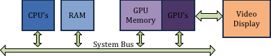

# 1.1 - Introduction

## What is a WebGL Program?

一个典型的包含由WebGL程序生成的3D图形网页，一般有如下部分：
* 一个HTML页面
* 用来定义网页元素格式的CSS
* 在HTML页面上要包含一个canvas元素，它提供了一个用于绘制3D计算机图形的矩形区域
* 用于渲染3D模型的图形数据
* 用于加载图形数据、配置图形数据、渲染图形数和相应用户时间的JavaScript程序
* 用来执行渲染图形的关键部分的OpenGL着色器程序

所有的这些最初存在于Web服务器上。当用户(一个客户端)请求一个包含3D图形的Web页面，上面说到的那些数据将传输到客户机上，存储在正确的地方，并被相应的处理器处理。现代的计算机设备由多种不同类型的处理器：

1. CPU's - 中央处理单元 - 是设备的大脑，CPU执行一般的处理并运行控制设备整体功能的操作系统(OS)
2. GPU's - 图形处理单元 - 专门设计用于渲染3D图形

现代计算机设备还具有很多用于不同目的不同类型存储。

1. RAM - 随机访问存储器 - 保存程序数据和程序指令
2. Graphics memory - 用户视频和图形处理的独立存储系统。GPU具有专为3D图形设计的专用内存。

如下图所示：

Major hardware pieces in a computing device
