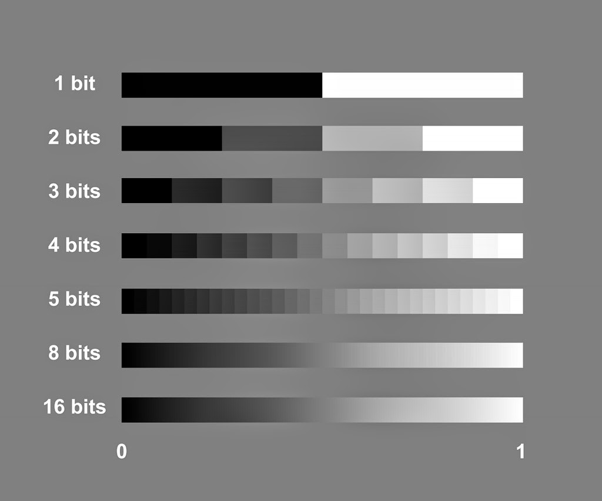

# 3.6 - Color

模型表面里最基本的表面属性是它的颜色。

## Color Models

对于使用光线产生图像的设备，例如计算机的显示器，它显示的颜色被建模为三种基本颜色的组合：红，绿，蓝。光是可叠加的，如果以全强度添加红色，绿色和蓝色，那么你会得到白光。没有光则产生黑光。人眼可辨别的所有颜色都可以使用红、绿和蓝光的某种组合来创建。这就是 RGB（红、绿、蓝）颜色系统。

对于使用反射光产生图像的设备，例如打印的页面，它的颜色被建模为三种基本色的组合：青色（cyan）、品红色（magenta ）和黄色（yellow）。这些颜料吸收某些波长的光，基本上反射红、绿和蓝光。所以这不是一种不同的颜色表示方式，它只是一种产生反射光的不同方式。打印纸上的所有可以被人眼识别的颜色都可以使用青色、品红色和黄色颜料的某种组合来创建。这被称为 CMY（青色、品红色、黄色）颜色系统。打印机通常也使用空白颜料来获得更清晰的黑色。这称为 CMYK 系统，其中 K 代表“黑色(blacK)”。

以 RGB 表示的颜色可以转换为 CMYK 表示的颜色，反之亦然。我们将专注于 RGB 颜色，因为这是 WebGL 程序通常使用的颜色。

我们需要三个值来表示特定颜色：红、绿和蓝光的量。将这些值设为百分比是有意义的：0% 表示没有颜色，而 100% 表示全彩色。这将由设备的硬件来决定颜色的100%意味着什么。如果你看着商店中各种品牌的电视，你就会很快意识到这一点。它们不会从相同的数据中重新创建相同的颜色！（每个品牌的电视机都有色差）

## Device Independent Color

请记住，在浏览器中创建 WebGL 程序的目标之一是图形将在跨平台环境中正确执行。我们可能想指定与设备无关的颜色。设备独立颜色的标准方案使用浮点值。因此，(0.45, 0.23, 0.89) 表示具有 45% 的红色、23% 的绿色和 89% 的蓝色的颜色。用浮点值可以表示多少种唯一的颜色？很多。每个组合值可以代表大约 800 万个不同的百分比值。这大约 600,000,000,000,000,000,000 种可能的颜色！人眼能看到这些颜色吗？回答是不能。通常人眼只能看到特定色调中大约250种不同色调变化，尽管颜色感知因人而异。考虑下面的图像，该图像显示了不同颜色深度选择下的各种黑色和白色色调。



上图中有以下几点需要注意：
* 每个色块都是一种纯色，即使看起来颜色在块内发生变化。这种现象称为马赫带（mach bands）。为了证明上面的每个色块都是一种纯色，请拿两张纸并盖住特定色块两侧的色块。方块会变成一种统一的颜色！取下覆盖物，“条带”效果将重新出现。你的眼睛旨在增强对比度。
* 对于大多数人来说，8 位色深提供了平滑的颜色渐变。你能在上图中 “8 位” 图像中看到任何马赫带吗？如果不能，这意味着该图像等于或高于你眼睛的最大颜色分辨率。
* “8 位”色深允许 256 种不同的黑白色调。如果你的每个 RGB 分量值都是 8 位，你可以表示超过 1600 万种不同的颜色（2<sup>8</sup>)。对于普通人来说，这种颜色精度被认为是“全色”。

## Transparency

一个不透明的物体看起来很坚固，并且基本上反射了所有照射到它的光。透明物体允许一些光穿过它。物体的透明度可以根据构成他的材料而有很大差异。例如，玻璃杯可能具有高的透明度，而水则是部分透明的。准确地建模透明度是非常困难的。一种简单的透明度建模方法是将“不透明百分比”与颜色值一起存储。这个百分比被称为“阿尔法值(alpha value)”。RGBA 颜色系统为一种颜色存储了 4 个分量值，其中前三个值是红色、绿色和蓝色分量，最后一个值是 alpha 值。你还将看到对 ABGR 和 ARGB 系统所表示的色的引用。字母的顺序表示颜色规范中值的顺序。

以下是使用浮点半分比来表示分量的实例：

| RGBA color | Opaque | Transparent |
|------------|--------|-------------|
| (0.2, 0.1, 0.9, 1.0) | opaque, all light is reflected | 0% transparent |
| (0.2, 0.1, 0.9, 0.9) | mostly opaque | 10% transparent |
| (0.2, 0.1, 0.9, 0.5) | half the light passed through the object | 50% transparent |
| (0.2, 0.1, 0.9, 0.0) | all light travels through the the object, the object is invisible | 100% transparent |

## Shades of Color(色调)

请注意，由于 (0,0,0) 是黑色而 (1,1,1) 是白色，任何特定颜色的色调都是通过靠近黑色或白色来创建的。你可以使用参数方程来表示两个值之间的线性关系，以使颜色的色调更暗或更亮。

用于计算值 A 和 B 之间线性变化的参数方程

```javascript
C = A + (B-A)*t;  // where t varies between 0 and 1
```

要更改颜色 (r,g,b) 以使其更亮，请将值向 (1,1,1) 靠近。

```javascript
newR = r + (1-r)*t;  // where t varies between 0 and 1
newG = g + (1-g)*t;  // where t varies between 0 and 1
newB = b + (1-b)*t;  // where t varies between 0 and 1
```

要更改颜色 (r,g,b) 以使其更暗，请将值向 (0,0,0) 靠近。

```javascript
newR = r + (0-r)*t;  // where t varies between 0 and 1
newG = g + (0-g)*t;  // where t varies between 0 and 1
newB = b + (0-b)*t;  // where t varies between 0 and 1
// or
newR = r*t;  // where t varies between 1 and 0
newG = g*t;  // where t varies between 1 and 0
newB = b*t;  // where t varies between 1 and 0
```

## WebGL Color

WebGL 中的所有颜色都需要一个四分量的 RGBA 值。如果你没有指定 alpha 值，则该值将被设定为 1.0 (不透明)。WebGL 1.0 要求所有顶点属性都是浮点值。因此，不透明的颜色值将被存储为 3 个浮点值，而允许设置透明度的颜色值将需要 4 个浮点值。