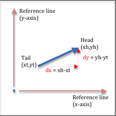
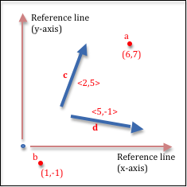
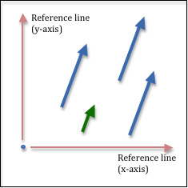
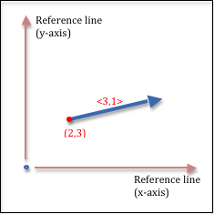
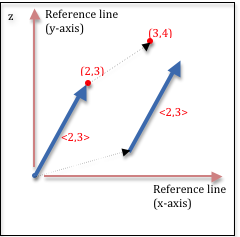

# 3.3 - Direction / Orientation

位置告诉我们某物与商定的参考系间的关系（例如：一个全局原点和一组坐标系轴）。物体的方向同样很重要。一个对象是朝北，朝南，向下还是向上。方向可以是相对的或者是绝对的。

* 相对 方向与对象的当前位置和方向有关。例如，如果一个人面朝北， 那么他的左侧是西方，他的右侧是东方。向左/向右、向前/向后和向上/向下等方向与对象的当前方向有关。
* 绝对 方向相对于固定的参考系，并且始终指向同一方向，与它们的位置无关。北/南和东/西等方向是绝对方向的示例。（我们将在此讨论中忽略北极和南极的位置问题！）

有很多种方法表示方向，包括距离和角度的不同组合，我们可以通过类似于上一课关于位置的讨论来开发一些不同的方法。但是让我们直接跳到表示方向的标准方法上 - 向量。向量使用与笛卡尔坐标相似的符号 - 沿参考线的距离。实际上，向量和位置容易被混淆，所以我们需要一些时间来区分他们。

## 向量

向量可以被直观的表示为一端带有箭头的线。矢量代表方向，所以箭头很重要。箭头指向向量所代表的方向。没有箭头的一端称为“尾”（tail），有箭头的一端称为“头”（head）。向量被定义为沿每条参考线从尾部到头部的变化。因此一个向量由两个数字定义：x变化了多少和y变化了多少。这些值通常称为“delta x”（或 dx）和“delta y”（或 dy），就像下图的例子中所示。如果你使用两个值定义一个向量，“delta x”和“delta y”值是通过头坐标与尾坐标相减而得到。(head - tail).

因为向量的标准表示法是使用两个距离，而二维空间中的某个位置的笛卡尔坐标也是两个距离，位置和方向有的时候会被混淆。为了能分开这两个概念，本教程使用尖括号中放置距离来表示向量，类似<2，5>，或者按照一般来说，在二维空间那样用<dx, dy>表示。在三位空间中使用三个偏移量表示<dx, dy, dz>。如果我们使用变量名来表示点或者向量，我们使用单个字母来表示点，如：a, b, c，然后我们使用加粗的字母来表示向量，如：**a**,**b**,**c**。如下图所示。

<dx, dy>表示的向量没有位置。这样的向量表示的是基于商定的参考系中的绝对方向。再说一遍，又<dx, dy>定义的向量是有方向的，但是没有位置。具有相同的<dx,dy>的两个向量是相同的，无论你如何绘制他们。如下图中的三个蓝色向量都相同。绿色的向量与蓝色的向量表示同样的方向，但是它的长度不同。一个向量实际上表示两个含义：方向和距离（或者长度）。它的方向由其头部的箭头指示。它的距离是它从尾部到头部的长度。如果一个向量的长度是一个单位，那么这个向量称为单位向量。如果一组向量被转换成单位向量后，具有相同的<dx,dy>值，那么他么具有相同的方向。我们通常将向量转换为单位向量，因为它简化了向量操作的数学计算，并且它可以使特定方向表示唯一。如果你将一个向量转化成单位长度，那么你就是在“规范化”向量（归一化向量），因为指向同一方向的所有向量都具有相同的单位向量。因此，归一化向量是一个特定绝对方向的唯一表示。

如果你想使用向量来表示一个相对的方向，你需要一个向量和具体的尾部位置。(point, vector)这两个值对表示相对方向。例如，点(2,3)和向量<3,1>表示从特定位置(2,3)的一个相对方向。

## Vectors vs. Points

注意在空间中的一个点用来表示距离原点的一个方向，那么点和向量使用相同的距离值来定义。（例如，点(2,3)和向量<2,3>，如下图所示）。然而，这并不意味着点和向量相等。这个点在空间中是一个单一且独特的位置，而向量则是个方向。点与向量的主要不同点是：点有位置，而向量没有。如果你移动一个点，则它的位置会被改变。如果你移动一个向量，则不会改变向量。点和向量表示不同的事物并以不同的方法被操纵。

## Vector Summary

* 方向总是相对于某事物的。
* 矢量表示的是相对于参考系中的一个绝对方向。
* 当与起点结合时，向量表示相对方向。
* 计算机图形通常使用两个距离表示二维向量<dx,dy> ，使用三个距离表示的 3 维向量，<dx,dy,dz>
* 矢量代表方向和距离。
* 使向量具有一个单位的长度即将其“标准化”为该方向的唯一表示。
* 向量无法“移动”，因为它们没有位置。

## WebGL Vectors

矢量广泛用于模型表示和描述动画中对象的运动。它们由三个分量值表示，<dx, dy, dz>，使用浮点数。这意味着单个向量需要 12 字节的内存。向量可以使用其他数据类型表示，如上一节所述，这可以节省内存，但很少这样做。

## Manipulating Vectors

可以改变向量的方向和长度来操纵向量。以下操作具有物理意义：
* 旋转 - 改变矢量的方向。
* 缩放 - 改变向量的长度。
* 归一化 - 保持向量的方向不变，但使其长度为 1 个单位。
* 两个向量相加。它的结果是一个表示方向的向量，长度是原始方向的长度总和。
* 两个向量相减。它的结果是一个表示方向的向量，长度是原始方向的长度的差值。
* 给定一个点，让它与一个向量相加。结果是一个位于新位置的新点。
* 给定一个点，让它与一个向量相减。结果是新点位于新位置。

请注意，将两个向量相乘或相除在物理上没有意义。