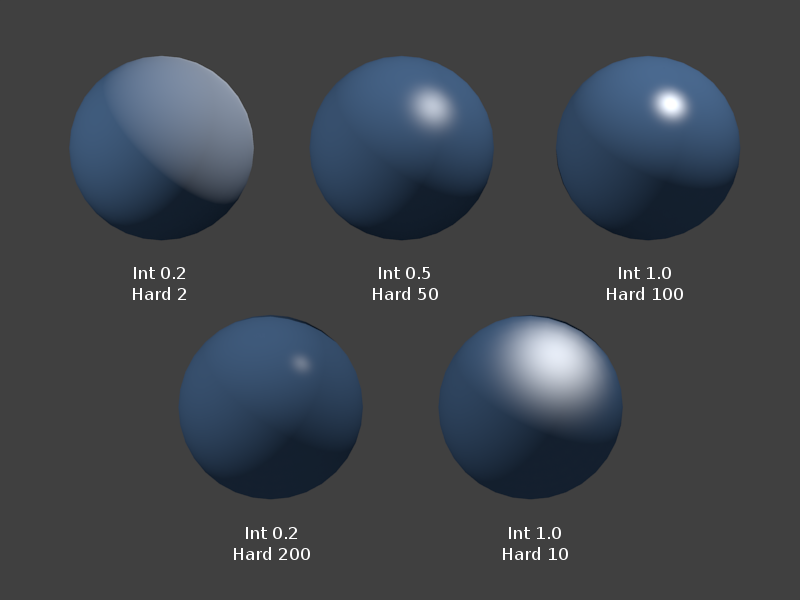

# 3.8 - Light Modeling

要模拟对象在现实世界中的外观，你必须模拟光如何与对象表面相互作用。当光线照射到物体时，会发生以下四种情况中的一种或多种：
* 光线向不同的方向反射。发射光的方向由对象的反射面的表面属性决定。
* 光被物体吸收并被转化成能量，随着时间的推移而加热物体（这被称为吸收 “absorption”）
* 光线穿过物体并沿着不同的轨道继续传播。（光穿过物被称为透明度，方向的变化称为折射。）
* 光进入物体，在物体内部反弹，然后在与它照射的不同位置离开物体。（这被称为次表面散射。）

所有这些交互进行建模是复杂且非常困难的。这是可以做到的，但是超出了本基础教程的范围。我们将只讨论光如何从物体反射。仅使用反射光无法生成照片般逼真的图像，但是在尝试更复杂的建模之前，你需要了解基础知识。

## Light Sources

在现实世界中光来自光源。太阳是最明显的光源。其他光源包括灯、聚光灯、火和爆炸。光的特性根据其来源而变化。如果我们希望获得合理的渲染效果，我们需要对光的这些基本属性进行建模。们将对光源的以下属性进行建模：
* 位置 - 光从哪里来？有两种情况：
  * 定向（Directional） - 光源离得很远，以至于所有的光线基本上都在同一个方向上传播。太阳就是定向光源。
  * 位置（Positional） - 光源在场景内。光线照射到物体上的角度是根据它们的相对位置而变化的。请注意，光线照射到单个三角形的各个顶点的角度会有所不同。
* 颜色 - 例如，红色聚光灯
* 点与聚光灯（Spotlight） - 光是向各个方向传播，还是仅限于某个特定方向，例如手电筒。

因为光可以有不同的颜色，我们对光进行建模的方式与使用 RGB 值模拟表面颜色的方式一样。红光是 (1.0, 0.0, 0.0) 而白光是 (1.0, 1.0, 1.0)。

## Ambient Reflected Light（环境反射光）

有些时候你不知道场景中的光源是什么。例如，假设在一间黑房间里，你可以看到物体，但是你可能不知道房间的光是从哪里来的。它可能是从窗户照射进来的月光，或者其他间房的灯光从门下透过来的光，或者是夜灯微弱的光芒。不是直接来自光源而只是在场景中反射的光称为环境光（ambient light）。

环境光是“背景”光。它向四面八方到处反弹，没有特定的起源位置。环境光照亮了模型的每个表面。因此，获得直射光的表面和隐藏在直射光下的表面都被相同数量的环境光照亮。

环境光的量决定了场景中的整体光。(0.1, 0.1, 0.1) 的环境光会模拟一个暗室，而 (0.4, 0.4, 0.4) 的环境光会模拟一个光线充足的房间。(0.2, 0.0, 0.0) 的环境光将模拟低强度红光渗透到一个场景中。您使用的确切值通常更多是基于实验结果，而不是场景的实际物理属性。

## Diffuse Reflected Light（漫反射光）

从物体表面反射的光量与表面相对于光源的方向有关。如果光线“直接”（straight on）照射到表面，大部分光线将被反射。如果光只是从物体的一侧“擦边”（grazes off），那么反射的光就很少。下图说明了这一点。

我们假设物体的表面不是完全光滑的，并且当光线从表面反射时，它会向各个方向均匀散射。对于漫射光，问题是发生了多少反射，而不是反射的方向。在物理学中，兰伯特余弦定律（Lambert’s cosine law）给了我们反射量。

如果我们取表面法向量和光线之间夹角的余弦值，就可以得到反射光的数量。当角度为零时，cos(0) 为 1.0，所有光都被反射。当角度为 90 度时，cos(90) 为 0.0 并且没有光被反射。如果 cos() 为负，则面的方向远离光源并且没有光反射。反射光的量不是线性关系，正如在下图中的余弦函数图中看到的那样。

如果将表面的颜色乘以表面法线和光线之间夹角的余弦值，则会将颜色缩放为黑色。这正是我们想要的结果。随着从表面反射的光越来越少，表面变得更暗。

## Specular Reflected Light (镜面反射光)

如果对象很光滑，从对象表面反射的光会直接反射到观察者的眼睛里（或者相机的镜头）。这会创建一个“镜面高亮”（specular highlight），即光线的颜色是光源的颜色，而不是物体的颜色，因为你实际上看到的是光源的光。图像中蓝色球上的每个白色区域都是镜面高亮。

镜面高亮的位置取决于观察者的视线到物体表面的一个点间的夹角以及光线的精确反射。表面法线用于计算反射光线。请研究下图

 
镜面高亮（反射光线和到相机的光线之间的角度。）

## WebGL Implementation

WebGL 中的所有灯光效果都由程序员在片段着色器中完成。要实现上述三种照明效果，你应该执行以下操作：
* 从光源模型中获取环境光量。
* 计算表面法向量与光线方向的夹角。
* 将角度的余弦乘以表面的漫反射颜色。
* 计算光反射和相机方向之间的角度。
* 将角度的余弦乘以灯光模型的镜面反射颜色。
* 添加环境、漫反射和镜面反射颜色。这就是三角形表面片段的像素颜色。

我们将在第 10 节和第 11 节中介绍实现照明模型的细节。