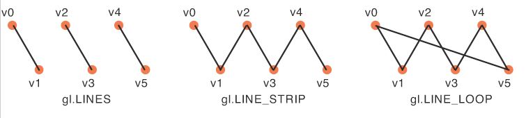

# 3.10 - Lines

WebGL支持线的渲染。如果你想绘制模型的线框渲染，或是用边框或高亮勾勒出一个表面，这会很有用。

在WebGL中你总是使用一个顶点数组来定义一条或者多条线。可以通过三种不同的方法来使用这些顶点构成线，如下图所示的方法：
* `LINES` - 每个线两个顶点。如果一个顶点被多条线使用，它必须重复出现在顶点数组中。定义 n 条线需要 2n 个顶点。
* `LINE_STRIP` - 在初始的两个顶点后，每一个额外的顶点定义一条线。定义 n 条线需要 (n + 1) 个顶点。
* `LINE_LOOP` - 与 LINE_STRIP 相同，添加的线将连接第一个和最后一个顶点。定义 n 条线需要 n 个顶点。

