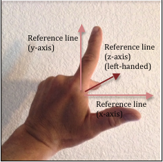

# 3.2 - Modeling Location

## Location Is Relative(位置是相对的)

位置总是与一些东西相关。让我再说一遍“位置总是相对的”。例如，如果你被问到：“Where is Colorado Springs?”，典型的回答可能是:“Well, its 60 miles south of Denver.” 。如果你不知道Denver在哪里，那你就“倒霉了”。

所以我们需要一个“参考点”来描述对象的位置。我们把这个参考点称为“全局原点”(global origin)。“全局”(global)这个词表示一个场景中的所有对象都相对与这个唯一位置进行定位。

另外，每一个对象都有一个“局部原点”，这个原点用来参考与这个对象相关的位置。例如，在一个房间里，会有一个“局部原点”用来定位它的墙和它内部的家具，一个房子会有一个局部原点，用来定位它内部的房间，一个社区会有一个局部原点，用来定位社区内部的房屋。等等。。。

定位场景中的每个对象，是通过指定局部原点和全局原点间的关系来确定的。注意，位置始终是两点间的关系。

这些知识很重要，让我们再重申以下：
* 位置总是相对的
* 一个场景中，所有的对象位置已经确定的情况下，只存在一个唯一的全局原点。一个场景只有一个唯一的全局原点。
* 在场景中的每个单独的对象都有一个局部原点，对象的各个部分都是通过该点来定位的。
* 场景中的对象通过指定局部原点和全局原点间的关系来确定位置的。

现在我们需要决定如何根据原点来指定位置。一个自然的方法是指定距离。用于测量距离的单位很重要，例如英里，米，英尺，英寸，毫米等。但是如果你使用一致的单位并且始终用这个单位进行测量，那么单位就可以被忽略。对于本次讨论的剩余部分，我们将忽略测量单位 - 但是记住，当你描述位置，应该使用同样的测量单位。

## Describing Locations

我们可以使用类似于“它距离远点10个单位”，这样的描述来指定一个对象的位置。

但是我们马上就会遇到一个问题。会有无限个“拘役原点10个单位”的点。距离一个点10各单位的所有点，可以组成一个圆。

要指定一个唯一的位置，我们可以通过指定一个角度来得到这个位置。然而，角度，就像位置一样，也总是相对于某物。所以我们需要一个线性参考来测量角度。让我们绘制一条通过原点的水平线。现在我们可以通过原点和参考线的角度来指定一个确定的位置。数学家将这种描述位置的方法成为“极坐标”。如果 `r` 表示的是位置的距离，`theta` 表示角度，那么他们就描述了一个相对于原点和参考线唯一的位置。如果我们可以摆脱角度而只处理距离，那就太好了。

一个可能的选择是使用到对象的距离和沿着参考线的距离。传统上，将这个参考线成为x轴，所以我们的位置描述是一个距离对：(r,x)。然而这不是唯一描述，因为有两个点与这两个距离相关联。

所以是否存在一个更好的距离对，用来定位一个点？如果我们创建第二条参考线，我们可以使用沿着每条参考线的距离。第二条参考线可以在任何方向上，但是如果这条线穿过原点并且与原来的参考线成90度夹角，在数学上会变得更简单。所以现在我们在二维空间上有两个距离来定位一个对象。并且移动位置所使用的数学方法会很简单 - 简单的加法。

请注意第二条参考线，传统上称为y轴，它可以被放置在两个可能的位置上 - 向上或者向下。事实证明，这两个方向都被用于计算机图形学。当我们描述一个二维空间中的虚拟对象，我们的管理是使用“y向上”来描述，因为它是用于表示二维空间最传统的数学符号。当我们描述计算机屏幕上的一个像素位置时，我们的管理是使用“y向下”的描述，因为几乎所有的屏幕像素位置是从屏幕的左上角沿着屏幕左边的y轴向下。这是因为历史上计算机屏幕的制作方式与电视显示器相同，电视画面的显示方式是从左上角开始刷新屏幕像素，从左到右，从上到下刷新。

同时也需要注意当我们将描述一个位置的方式从（距离，角度）编程（距离，距离），我们需要引入负距离的概念。在现实的世界中，距离总是正的。在（距离，距离）表示法中，负距离一位置沿着一条参考线，但是方向相反。因此，（-2，4)表示的位置如下图所示。

在我们进入到三维空间之前，让我们总结一下对位置的讨论：
* 位置总是相对的
* 使用沿着2条参考线的距离来指定一个位置
* 参考线从全局原点出发，彼此成直角
* 参考线创建了一个“坐标系”，它为我们的位置距离赋予了意义
* 我们将参考线称为“轴”，这个坐标系被称为“笛卡尔坐标系”
* 坐标 (3,-6) 定义了沿 x 轴 3 个单位和沿 y 轴 -6 个单位的位置。

## 3-dimensional locations

在 3 维空间中描述位置的一种自然方法是使用映射和地理应用方法，使用一个距离和两个角度。这两个角度称为经度(longitude)和纬度(latitude)，它们代表本初子午线(prime meridian)和赤道(equator)的角度。(记住，所有的位置都与某物相关)距离相对与海平面，海平面代表高度（altitude）。高度总是沿一条线到地球中心的距离，所以高度的参考点实际上是地球的中心。世界上的任何位置都可以通过三值表示法(longitude, latitude, altitude)来唯一的描述。同样，虽然这种表示对于地图制作者和航空公司飞行员来说是很自然的，但使用两个角度和一个距离的组合会使操纵位置的数学方法变得麻烦。

3维空间的位置如果采用的是沿着三条参考线的三个距离来表示的，那么操作起来会很容易。所以我们在三维空间中创建第三条参考线，这条参考线与其它两条参考线的夹角为90度。它被称为z轴。同样的，这条线有两个方向可供选择。这条线可以是“out of the paper”或者“go into the paper”（即，垂直x轴和y轴组成的平面向下或者向上）。这两个朝向被称为“右手”或“左手”坐标系，因为它们可以用一个人的右手或左手来表示。

使用你的右手（假设y轴向上），将你的拇指指向x轴，你的食指指向y轴。对于右手坐标系来说，你的中指指向的是z轴。如果你的拇指指向右侧，那么z轴将要指向你。

如果使用你的左手，将你的拇指指向x轴，你的食指指向y轴，那么你的中指将会指向相反的方向，或者远离你。这就是左手坐标系。

使用哪个三维坐标系统是存在争论的。微软的Direct3D系统使用的是左手坐标系统。而WebGL与大部分工程师和数学方法中使用的是右手坐标系统。这其实不是什么争论，只是不同的选择。重要的是坚持并总是使用一样的约定。对于本教程的后续部分，我们将会使用右手坐标系统来定义位置。将使用沿 3 条参考线的 3 个距离指定位置，如右图所示，z 轴始终朝向您，朝向屏幕之外。

## Manipulating Locations

可以操纵一个点来改变它的位置。这是所有计算机图形动画的精髓 - 一个点的位置随着时间变化。典型的操作包括平移（translation）、旋转（rotation）和缩放（scaling）。我们将在第6张介绍这些内容。

## WebGL Points

WebGL 在齐次坐标中指定一个位置，它是一个 4 分量值 - (x,y,z,w)。头三个值，x, y, z 分别是沿笛卡尔坐标系轴的距离。最后一个值，w 用于透视计算，稍后将详细讨论。就现在而言，w 将始终被设置为1.0。

当你向你的WebGL程序定义模型时，你的程序有些时候为了节省内存，只存储或者指定那些你关心的值，而其余不关心的则交由WebGL来处理。例如，如果要创建一个 2D 图形渲染，你可以存储 (x,y) 值，z 值将自动设置为零。

对于普通的三维模型，你的程序将为每个点保存三个浮点数。w 分量不会被保存并且总是被设置为默认值 1.0。浮点值需要 4 个字节的内存。这意味着模型中的每个点需要12个字节的内存。WebGL 1.0 要求顶点的所有属性都定义为浮点数。

WebGL 支持在 3D 空间中渲染单个点。如果你想要绘制一个或者多个点，你将这些点放到一个数组中然后调用 `drawArrays()` 函数。这些点将在渲染中显示为单个像素。当我们稍后在这些教程中学习 GL 着色器时，您将学习如何更改点的 `gl_PointSize` 属性以使它们在渲染中显得更大。