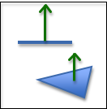
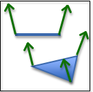
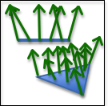
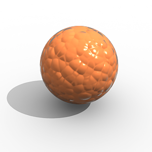

# 3.9 - Surface Normals

在上一节中，你学习了如何使用反射光对物体表面的外观进行建模。表面法向量是表面的基本属性，用于计算表面的颜色。可以使用表面法线来增强对象的视觉渲染效果。下面介绍其中的一些“技巧”。

## One Normal Vector Per Triangle （每个三角形一个法向量）

这是默认行为。表面上的每个像素都有相同的颜色。这被称为“平面着色”（flat shading）。（如果一个三角形的法向量没有指定，那么可以通过三角形的俩条边的叉积（cross-product）计算得到）

## One Normal Vector Per Vertex（每个顶点一个法向量）

如果你为每个顶点指定不同的法向量，那么你就可以为每个顶点计算不同的颜色。然后可以通过顶点颜色进行内插整个表面来计算每个像素的颜色。如果顶点法向量设置正确，表面将具有弯曲的外观（而不是平坦的外观）。（这种技术以其发明者的名字命名，称为 [Gouraud shading](https://en.wikipedia.org/wiki/Gouraud_shading)）

如果你对整个表面的顶点插入法向量，然后使用插入的法向量重新计算片段颜色，你将获得整个表面更准确的着色。这种方法需要更长的时间来计算，但可以提供更平滑的颜色渐变。这称为 Phong shading。

这两种技术都被称为“平滑着色”。

## One Normal Vector Per Pixel（每个像素一个法向量）

你可以为每个像素指定唯一的法向量来控制三角形表面上单个像素的着色。这是通过创建一个图像来完成的，其中图像中的每个“像素”不被视为 RGB 值，而被视为 <dx,dy,dz> 法线向量。这被称为凹凸贴图(bump map)。

下图是使用凹凸贴图的示例渲染。

## WebGL Implementation

程序员可以在他们的着色器程序中实现任何这些技术。每个面一个法向量和每个定点一个法向量这两种方法可以在顶点着色器(vertex shaders)中实现。

Phong shading 和 bump maps 需要在片段着色器(fragment shaders )中实现，因为他们要为每个像素计算颜色。