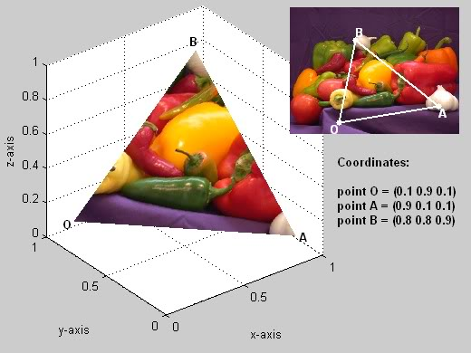

# 3.7 - Texture Maps

现实世界里的物体表面很少有单色的。我们需要一个方法来为表面的不同颜色进行建模。纹理贴图（Texture maps）允许我们这样做。让我们从映射 “mapping” 开始。

## What is a Mapping?

在数学中，映射是将一组输入转换成输出值的函数。有两种方法可以做到这一点：
* 对输入执行计算以产生输出值。
* 从一个可能值列表中查找输出值。这被称为表查找(table lookup)。

映射的输出通常是某种模式，所以在计算机图形学中形成的这个模式，我们把将输入到输出的转换称为纹理贴图（Texture map）。

“纹理贴图”允许我们为模型表面的每个像素分配不同的颜色。

## Procedural Texture Maps（程序化的纹理贴图）

程序化的纹理贴图是一种使用计算将输入值转换为一种颜色的函数。计算的结果可以用于选择一个颜色，或者计算后的值可以用于常见一个颜色。可以用于计算的模式的数量是没有限制的。下面的例子是生成一个 10 像素宽的黑白棋盘图案。

```javascript
function checkerboard(x,y) {
  if ( floor(x/10) + floor(y/10) mod 2 == 1) {
    color = [ 0, 0, 0, 1]; // black
  } else {
    color = [ 1, 1, 1, 1]; // white
  }
  return color;
}
```

输入值可以是任何你想要基于着色的值。1D 纹理贴图采用单个输入值并返回颜色。2D 纹理贴图采用两个输入值并返回一种颜色。3D 纹理贴图采用三个输入值并返回一种颜色。你明白了。

## Image Texture Maps

“表查找”纹理贴图通常使用图像进行贴图。一个图像是一个颜色值的二维数组。给定行和列的值，可以很容易的得到图像中特定位置像素的颜色。在下面的为代码中，纹理贴图看起来像这样：

```javascript
function getColor(image, x, y) {
  return image[x][y]; // the color of the indicated pixel
}
```

图像是为一个模型表面指定一组颜色值的便捷的方法，因为有很多工具使图像处理变得很容易,例如 [`gimp`](https://www.gimp.org/)。然而，图像都是矩形，而WebGL只渲染三角形。我们需要一个方法来指定图像中的哪些像素包含三角形表面的颜色。

“纹理坐标(Texture coordinates)” 指定了图像中的哪个位置对应着三角形的顶点。要使纹理坐标适用于任何图像，使用百分比来指定位置。例如，0.0 指的是图像的左边，1.0 指的使图像的右边，0.5 指的是图像的中间。一张图像如下图所示。顶点 **B** 使用纹理坐标(0.31, 0.74)被映射到图像的指定位置，因为我们希望在顶点 B 处显示的图像中的颜色距离左边缘 31%，距离底部边缘 74%。一旦三个 3D 顶点映射到图像中的相应位置，那么内部的位置就可以被轻松计算出来。



请注意，如果 3D 三角形的比例与图像上的区域不成比例，显示在 3D 三角形上的“图片”将是扭曲。很难用手工的方式分配一个不扭曲图像的纹理坐标。Blender 之类的工具极大地有助于创建适当的纹理坐标。

## WebGL Implementation

WebGL 支持程序化的和基于图像的纹理映射。
* 程序化纹理映射是通过在片段着色器中编写函数来执行的。
* 基于图像的纹理映射需要执行如下几步：
  * 从服务器上下载一个适当的图像。
  * 创建一个 GPU 的纹理对象并且将其保存在 GPU的内存中。
  * 在片段着色器中使用表查找功能从图像中获取特定像素的颜色。

纹理映射的更多实现细节将在第 11 节介绍。