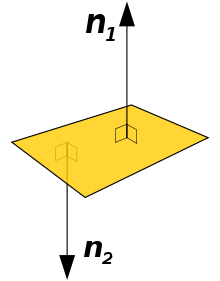

# 3.4 - Volume / Surfaces

我们已经讨论了位置和方向。现在我们需要讨论如何表示三位形状和他们在空间中所占的面积。一个对象可能是一个立方体、一个球体、一个平面或一个复杂的斑点。物体可以呈现出无限种形式。以独特的方式描述每个对象当然是可能的，但这需要为每个对象使用独特的渲染算法。我们想要的是一种统一的方式来描述任何类型的对象，而不管其形式的复杂程度。您可能会感到惊讶，但几乎所有渲染算法都只知道如何渲染三角形！

为什么是三角形？
* 三角形是最简单的被定义成一个封闭区域的几何形状。三角形有内部区域和外部区域。
* 三角形总是平面的 - 它定义了一个平滑的表面
* 三角形将 3 维空间划分为三个不同的区域。3 维空间中的所有点都位于 1) 由三角形定义的平面中，2) 在平面的一侧或 3) 在平面的另一侧。将三角形视为一张平面纸。按照惯例，我们可以说三角形的一侧是正面（front side），另一侧是背面（back side）。通过组合三角形，我们可以创建具有内部和外部的形状。
* 三角形总是凸的；三角形不可能是凹的。渲染凹多边形比渲染凸多边形更难。

这些属性使三角形的渲染变得简单而快速，从而使 3D 实时图形成为可能！

## Defining Triangles

我们使用以前课程中介绍的位置和方向值来定义三角形。

空间中任意三个点（位置）可以定义一个三角形 - 只要这三个点不重合，并且不会在一条直线上。你可能认为三个点相互重叠或者成为一条直线的情况很少见，但是当您操作 3D 对象时，这些情况可能经常发生。因此，当您开发计算机图形软件时，您必须不断测试此类情况。三个点如果不能定义一个有效的三角形，这种情况被称为：退化情况（degenerate case）。退化情况是有问题的，因为它们不能定义封闭区域或将 3D 空间划分为 3 个区域。更重要的是退化情况导致操作三角形的数学方法失败。总之：
* 三角形由三个点（位置）定义。
* 退化情况：
  * 这三点没有区别（其中两或者三个点是相同的）。
  * 三个点在一条直线上。

三角形的三个点定义了三条边（edges）或边界线段（boundary line segments）。这三个点是边界线段相交的位置。两个几何对象的交点称为顶点（vertex）。建模软件将定义三角形的点称为顶点（vertices）。

一个三角形有两个面：正面和背面。由三角形的边包围的表面通常称为三角形的面（请注意，“face”是 sur“face”的缩写。）。三角形有两个面。观察者同一时间只能看到一个面。如果观察者位于三角形的正面，则观察者可以看到正面。同样的，如果观察者位于三角形的背面，则观察者只能看到三角形的背面。这很重要，因为在一个具有单一光源的场景中，三角形只有一个面可以发光。此外，三角形只有一个面可以面对着场景的相机。对于属于较大对象的三角形，表面的朝向可以用来确定这个表面是否可以被相机看到。

三角形的顶点顺序用来确定三角形的哪一个面是正面。如果你冲着三角形并且三角形的顶点的顺序是逆时针的，那么按照惯例，你看到的是三角形的正面。三角形顶点的顺序称为连接顺序（winding order)。有两种可能的连接顺序，如下图所示。如果三角形并没有按照你期望的被绘制，那可能是因为它顶点的连接顺序是相反的。

 
三角形的连接顺序

一个平面三角形有两个重要的向量与之有关。两个向量与三角形的每个顶点成直角。一个向量从正面指向远方，另一个向量从背面指向远方。如下图所示。你可以通过取三角形任意两条边的向量叉积（cross-product)来计算这些向量。你使用哪些边以及你执行叉积的顺序决定了你计算的是哪个向量。如果三角形的顶点具有逆时针连接顺序，并且我们取边 1（顶点 1 和 2 之间）和边 2（顶点 2 和 3 之间）的叉积，则将得到指向远离三角形正面的法向量。

记住向量没有位置，只有方向。因此，单个向量可以表示三角形表面上所有点的正面方向。

请注意如下有关三角形的方向/朝向的说明：
* 从三角形的正面指向远方且与三角形表面上的每个点都成直角的向量称为法向量（normal vector）。它通常被称为法线（normal）。
* 法向量可以根据需要随时（on the fly）的被计算出来（假设三角形的连接顺序是正确的），或者它可以一次被计算出来并与三角形的定义一起存储起来。这是资源分配的经典计算机科学问题。如果根据需要计算法线，则每次渲染三角形时 CPU（或 GPU）都必须做更多的工作。如果法线与三角形定义一起存储，则需要更多内存来存储每个三角形。
* 如果法向量是预先计算好的并与模型一起存储，它总是被归一化为单位长度，因为这样可以最大限度地减少重复渲染时所需的数学计算。
* 永远不需要计算或存储正面和背面的法向量，因为它们指向的方向是完全相反。如果正面法向量为 <3,-2,5>，则背面法向量为 <-3,2,-5>。

## Defining 3D Objects

任何 3 维对象的形式都可以用一组称为三角形网格的三角形来近似。 “海豚”图像显示了一个示例。

对象形状的准确性取决于用于对其进行建模的三角形数量。需要进行如下权衡：
* 使用最少的三角形，这意味着对象的形状是粗糙的近似形状，但是会使用非常少的内存渲染速度也很快
* 使用大量的三角形，这意味着对象的形状很精确，但渲染需要更多时间，而且 RAM 和 GPU 内存要求要大得多。

下图显示了如何随着三角形数量的增加而更加接近对象的形状。

定义实体对象的三角形网格中只有部分的三角才能从特定的视域角度看到。如果三角形的密度在对象的表面是均匀的，那么，一般来说，在任何时候，只有一般的三角形会被看到。有一个简单的测试方法可以确定一个三角形是否可以被看到。计算指向视角相机方向的向量与三角形法向量间的夹角。如果角度大于90度，那么三角形的正面朝向是远离相机的，因此它不能被看到 - 它将被模型中面向相机的其他三角形隐藏。两个向量之间的角度可以通过它们的点积来计算。这个简单的测试称为面部剔除（face culling），可以潜在地将渲染速度提高两倍。

请注意，面部剔除只能在实体模型上进行。如果模型没有完全包围模型的内部，那么有时其背面可见的三角形将无法正确的被渲染。

## WebGL Triangle Rendering Modes

在WebGL中，你总是使用顶点数组来定义一组三角形。顶点构成三角形有三种不同的方法，如下图所示：

* `TRIANGLES` - 每一个三角形有三个顶点，每一个顶点用于一个三角形。用于多个三角形的顶点必须在顶点数组中是重复的。定义 n 个三角形需要 3n 个顶点。
* `TRIANGLE_STRIP` - 在定义了最初的三个顶点之后，每个附加的顶点又定义了一个三角形。定义 n 个三角形需要 (n + 2) 个顶点。
* `TRIANGLE_FAN` - 所有三角形共享第一个顶点。在定义了前两个顶点之后，每个新顶点又创建一个三角形。定义 n 个三角形需要 (n + 2) 个顶点。

将三角形网格划分为最有效的 TRIANGLES、TRIANGLE_STRIP 和 TRIANGLE_FAN 组是一个非常困难的问题。你可以使用 TRIANGLE_STRIP 和 TRIANGLE_FAN 模式来节省大量内存，但实际上它们很少被使用。让我们考虑一个非常简单的例子。一个立方体由 8 个顶点和 12 个三角形（每个面由 2 个三角形 6 条边构成）定义。这里有很多方法可以渲染立方体，例如

* 所有三角形使用 `TRIANGLES` 模式。这需要一个包含 36 个顶点的数组（12 个三角形 * 3 个顶点/三角形）。
* 使用 2 个数组和 `TRIANGLE_FAN` 模式。一个扇形从左下角开始，另一个扇形从右上角开始。每一个扇形可以绘制6个三角形。这需要两个数组，每个数组有 8 个顶点，总共 16 个顶点。
* 使用 `TRIANGLE_STRIP` 模式绘制正面、右侧、背面和左侧。然后使用 2 个 `TRIANGLE_FAN` 模式：一个用于顶部 2 个面，一个用于底部 2 个面。这需一个 `TRIANGLE_STRIP` 模式的数组，这个数组有 10 个顶点，然后还需要顶部和底部的 2 个数组，每个数组包含 4 个顶点。这总共有18个顶点。
* 等等（许多其他组合也是可能的。）

优化三角形组以满足最小化内存的需求超出了本教程的范围。我们将严格限制自己在所有渲染中使用 `TRIANGLES` 模式 - 以使用更多 RAM 和 GPU 内存为代价。
