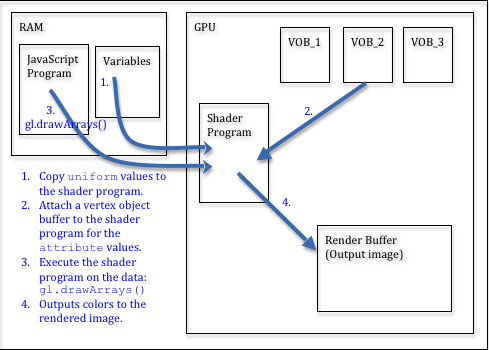

# 5.1 - Introduction to Rendering

## The Big Picture

你已经使用Blender创建了模型数据，并且你已经准备好使用WebGL在场景中渲染你的模型。此时真正好玩的地方才刚刚开始。

在一开始，让我们讨论一下WebGL的本质。WebGL是GPU(graphics processing unit)的API(application programmer interface) 。GPU是一个硬件设备，针对渲染实时3D图形进行了优化。你将编写着色器程序，它将被编译到硬件当中并以闪电般的速度运行。WebGL的API并没有准对程序员进行优化，而是针对快速硬件渲染进行了优化。从字面上理解WebGL 命令它就是在硬件中连接电路所使用的“翻转开关”。不要期望高级命令。WebGL API是一组低级的命令，用于控制硬件级功能。

就像我们已经讨论过的，有些预处理过程只会发生一次来设置WebGL和场景。接下来的步骤是将模型渲染到场景。每一次重新绘制场景，这些步骤都会被重复。

## Pre-processing: WebGL Setup

从高抽象层次上来看预处理步骤：
* 获取你要渲染的HTML画布元素。
* 获取 canvas 元素的 WebGL 上下文，通常称为 gl。
* 为 gl 上下文设置所需的状态。
* 编译顶点着色器和片段着色器程序并将其链接到渲染程序中。（可以创建多个渲染程序。）
* 从渲染程序中获取变量的引用，以便你可以在渲染时设置它们的值。
* 对于场景中的每个模型：
  * 将你的 OBJ 模型数据转换为适当的数组用来进行渲染。
  * 在 GPU 的内存中创建一个缓冲区对象。
  * 将模型数据复制到缓冲区对象中。

我们将在几个 JavaScript 类中介绍这些步骤的详细信息，因为：
* JavaScript 类将功能封装在一个地方，可以轻松执行一次。
* JavaScript 类可以将功能细节隐藏在一些函数调用之后。
* JavaScript 类使得功能很轻松的被重用。

## A Brief Introduction to Shader Programs
在我们继续讨论渲染模型的具体步骤前，我们需要讨论一下着色器程序后面的一些基本思想。在grphic pipeline中有两个阶段，你需要自己编写程序。你要使用GLSL（GL Shader Language）语言编写程序，然后将它们编译成机器指令，将它们链接成程序，将这个程序下载到GPU中，接下来当你渲染场景时就激活该程序。渲染的结果是一个二维像素阵列。为每个像素存储了很多数据，并操纵这些数据。与单个像素相关的一组数据被称为片段（fragment）。当你看到片段（fragment）这个词，就要想到“像素机器相关的渲染数据”。

请注意，一个三角形被渲染到图像上，可能需要100甚至1000个像素，因为观察者离三角形很近。如果观察者远离三角形，那么三角形的渲染可能只需要1到2个像素。渲染单个三角形而创建的片段数量将根据观察者与三角形间的距离而变化。

你的两个着色器在功能范围是非常有限的：
* vertex shader将模型的每个顶点变换到当前场景中正确的位置上。
* fragment shader将为由点、线、三角形组成的变短分配一种颜色。

这听起来非常简单，它也可以很简单。你可以使用一行代码的着色器程序来执行所需功能。或者你可以使用非常复杂的算法来进行今人的操作。着色器程序的美妙之处在于你可以完全控制图形过程。

注意，顶点着色器和片段着色器共享变量。顶点着色器设置变量的值，而片段着色器使用这些值。当我们仔细的学习着色器程序时，这会变的更清晰。

着色器程序使用三种类型的数据。它们是整个模型相同的数据，每个顶点变化的数据，以及点、线或三角形内部的每个片段变化的数据。这三类数据类型是：

|------------|--------|
| uniform   | 与图形管道执行相同的数据值。例如，如果你将为每个已经处理的顶点分配一个颜色，那么这些颜色应该是 `uniform` 。当你想到 `uniform`，应该想到它是固定的、不变的、不会被更改的值。|
| attribute | 当图形管道处理顶点时，每个顶点都会发生变化的数据值。典型的属性值是顶点的 (x,y,z) 位置。当你想到属性值时，请始终将顶点和它的术语包含在一起，就像是顶点属性一样。 |
| varying   | 在图形管道执行时为每个片段更改的数据值。可变变量允许为构成点、线或三角形的每个像素分配不同的颜色。 |

## Rendering Steps

你每一次渲染你的场景，你的javascript程序必须执行下面这些步骤：
* 清除保存渲染背景颜色的颜色缓冲区。
* 如果你正在做 *hidden surface removal*, 则清除深度缓冲区。
* 选择你的着色程序。
* 对于场景中的模型：
  * 将 `uniform` 变量的值传给着色程序。
  * 将每个 `attribute`变量与合适的缓冲区对象进行绑定。
  * 调用 WebGL的 `gl.drawArray()` 函数。

下图将形象化的帮助你理解这些步骤：

这些渲染步骤有很多事情要做。接下来的课程将涵盖所有细节。

## Rendering Speed Considerations

所有的渲染都在一个上下文中完成。这就像一个人做的事情那样。你可能在图书馆里学习，或者边学习边看足球比赛。你所处的上下文环境会影响到你的学习。人总是有意无意的切换上下文。如果你正在深入的思考一件事情，你可能需要几秒的时间才能意识到，有人在与你说话。
所有的上下文切换都需要时间。如果你不断的切换上下文，那么你的效率不会很高。

所有的现代计算机都在运行的进程间不断的进行上下文切换。GPU也不例外。你总是在一个上下文中进行渲染。切换上下文的次数越少，你的渲染就越快。所以，当你设置渲染进程，你的一个主要目标就是最小化上下文切换的数量。下面的活动将会导致GPU进行上下文切换：
* 选择一个着色程序。
* 设置着色程序中的 `uniform` 变量的值。
* 将一个 `attribute`变量与缓冲区对象进行绑定。
* 任何导致 gl JavaScript 对象状态发生变化的活动。

你的 JavaScript 程序和GPU间的任何通信都会导致渲染变慢。为了获得最大的渲染速度，你需要减少 JavaScript 函数调用 WebGL API的次数，你可以为每个模型创建单独的缓冲区对象，或者你可以在一个缓冲区对象中保存多个模型。可能的配置数量几乎无穷无尽。你将不断的在快速渲染的需求、用于图形数据的内存数量和你的代码复杂形之间进行权衡。

让我们重申一遍，任何JavaScript 程序和GPU间的通信都会导致渲染变慢。在理想情况下，你只需将所有模型数据复制到GPU-次。那么，当你进行渲染时，GPU已经拥有了它所需要的所有数据。如果模型数据必须在每次渲染之前由 JavaScript 代码操作，那么将数据从 RAM 传输到 GPU 内存将是一个主要的时间限制。在这种情况下，你需要将模型数据分成各种类型的数据，并且只传递发生变化的数据。例如，如果你的模型包括顶点，颜色和法向量，只有你的颜色数据被你的 JavaScript 程序操作，那么你应该将顶点和法向量数据放到GPU缓冲区对象中，将颜色数据放到单独的缓冲区对象中。当你渲染模型时，你的 JavaScript 代码将更改颜色的值，将它们拷贝到 GUP 的缓冲区对象中，接着调用 `gl.drawArray()` 函数。最小化每次渲染时复制到 GPU 的数据量将加快渲染速度。

一般来说，你首先应该让你的图形正确的渲染，然后优化它来加快渲染速度。你将会惊讶，GUP的渲染速度有多快，很多情况下不需要优化。在本教程中，我们编写的 JavaScript 代码和组织模型数据的原则，以强调清晰性为主 —— 而不是渲染优化。

## Code and Data Dependencies

WebGL 程序使用三个主要组件渲染模型：
* 着色器程序用来操纵顶点的位置和为像素赋值颜色。着色器程序运行在 GPU 上。
* 顶点对象缓冲区，用于在 GPU 上存储模型顶点属性数据。
* JavaScript 代码设置和启动渲染，JavaScript 代码由 CPU 执行。

这三个组件相互交织，以至于一个组件的简单更改通常需要更改所有组件。很遗憾，它使增量代码开发变得非常困难。在任何情况下，如果你更改着色器程序、缓冲区对象或 JavaScript 渲染函数的任何部分，请确保其他组件与你的更改兼容。