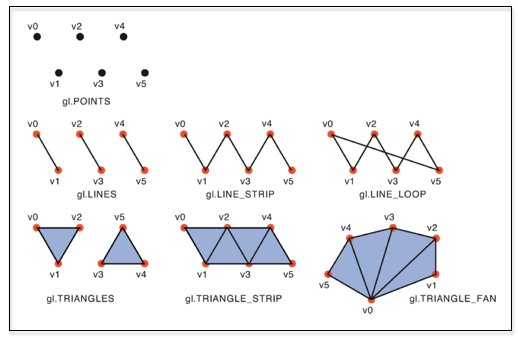
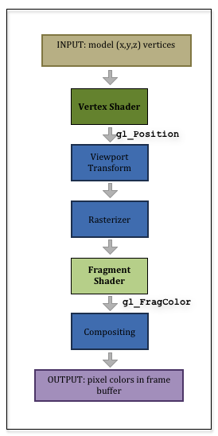

# 5.2 - A Primer on Shaders

## The Big Picture

本教程的第12章节会详细的介绍GL Shader Language (GLSL)。但是在开始前你需要了解一些“Big Picture”和一些有关语言方面的细节。

着色器程序处理单个顶点和单个片段，一次一个顶点和片段。你无法控制调用着色器程序。Graphic Pipeline会自动调用它们。

在开始一个着色器前，你需要将模型数据放置到 GPU 的顶点对象缓冲区（vertex object buffer）中，这个缓冲区是一块连续的内存，GPU 可以不通过系统总线直接访问它。顶点对象缓冲区必须组织成一个数组，可以使用索引进行访问，从数组中获取顺序值。在理想情况下，模型数据作为预处理步骤只需要通过一次拷贝到顶点对象缓冲区。你可以创建很多顶点对象缓冲区。每一个缓冲区存储着一个顶点数组的特别属性值，或者是整个模型的所有顶点属性。

要渲染一个模型，你的JavaScript代码需要告诉着色器程序，使用哪一个顶点对象缓冲区作为着色器程序的数据源。当你的JavaScript程序调用 `gl.drawArrays(mode, first, count)`,graphics pipeline将从顶点数组的 `array[first]` 开始获取顶点，渲染数组中 `count` 个顶点。如果你执行 `gl.drawArrays(mode, 5, 10)` 函数，那么graphics pipeline将会把数组的 `[5]` 和 `[14]` 间的顶点进行渲染。（数组的索引下标从0开始）

`gl.drawArrays` 函数的 `mode` 参数用来决定如何使用顶点来渲染元素（Element）。下图显示了不同mode的渲染效果：



顶点着色器对每一个从顶点对象缓冲区获取的顶点都执行相同的计算。顶点着色器的每一次执行都是一个唯一的运行时实例。你不能期望在一次执行中设置一个变量而在下一个运行时实例中该变量还保持这个值。这与你使用的其他开发语言的经验完全不同。

顶点着色器的职责是为一个特变变量 `gl_Position` 设置一个四个值的顶点（x, y, z, w）。这个值在Graphic Pipeline中传递到管道的下一个阶段。这很不一样。在你看到更具体的示例之前，这可能没有多大意义。但请继续阅读！

顶点着色器的输出 `gl_Position` 在Graphic Pipeline中被传递到下一个阶段 - 视角变换（Viewport Transformation）阶段。它将顶点的位置转换为渲染图像中的像素位置。像素位置（和它相关的渲染数据）被传递到下一个阶段 - 栅格化（Rasterizer）。这个阶段决定对象覆盖的像素。这取决于顶点是点、线还是三角形的一部分。光栅化列出了所有需要使用作色来表达对象的像素，并且将每个像素和与它相关的渲染数据传给片段着色器（fragment shader）。**记住像素和与它相关的渲染数据称为片段（fragment）。**

片段着色器的职责是为 `gl_FragColor` 这个特殊的变量设置 `RGBA` 颜色值。这个颜色会被传递到graphics pipeline的“组合”（compositng）阶段，该颜色值用于更新正在创建的光栅图像。

总结一下，你的顶点着色器（vertex shader）将要定位模型的顶点。你的片段做着色器（fragment shader）将为所有由定义模型的顶点转化而来的像素设置颜色。这可能很简单，也可能很复杂，取决于你的观点。请停下来，仔细研究下图。



## Fragments

这里要说清楚：
* 顶点着色器必须设置一个变量的值：`gl_Position`
* 片段着色器必须设置一个变量的值：`gl_FragColor`

但是管道中各个阶段间传递的值不止这些。顶点着色器和片段着色器在顶点基础上共享变量。因此，顶点着色器通常会将颜色和其他信息与 `gl_Position` 值相关联。这些信息会被传递到graphics pipeline的下一个阶段。当我们开发着色器程序时，我们需要清楚的知道数据在管道中是如何被传递的。

## Shader Language Variables

GLSL 是强类型语言。所有的变量在使用前必须被声明。变量的声明分为三部分：存储限定符（Storage Qualifier），数据类型（data type），变量名（variable name）。

存储限定符用来确定在调用 `gl.drawArrays()` 时，如何改变变量的值。

| Storage Qualifiers | description |
|------------|--------|
| uniform   | 与图形管道执行相同的数据值。例如，如果你将为每个已经处理的顶点分配一个颜色，那么这些颜色应该是 `uniform` 。当你想到 `uniform`，应该想到它是固定的、不变的、不会被更改的值。|
| attribute | 当图形管道处理顶点时，每个顶点都会发生变化的数据值。典型的属性值是顶点的 (x,y,z) 位置。当你想到属性值时，请始终将顶点和它的术语包含在一起，就像是顶点属性一样。 |
| varying   | 在图形管道执行时为每个片段更改的数据值。可变变量允许为构成点、线或三角形的每个像素分配不同的颜色。 |

数据类型确定变量存储的数据类型。有很多数据类型。目前，我们将仅限于以下内容：

| data type | description |
|-----------|-------------|
|int | 有符号整型 |
|float | 一个小数；大约 7 位数的精度。|
|vec3 | 3 个浮点数的向量。|
|vec4 | 4 个浮点数的向量。|
|mat4 | 一个 4x4 的浮点数矩阵。 （16 个值） |

变量的名称以字母或者下划线开头，只包含字母，数字，下划线。变量名称大小写敏感。一个共同的约定是, `uniform` 变量以 `u_` 开头，`attribute` 变量以 `a_` 开头，`varying` 变量以 `v_` 开头。

着色器程序的执行总是从 `main()` 函数开始。你可以实现很多你的着色器程序需要的子函数。

在 `main()` 之外定义的变量具有全局作用域。如果在顶点着色器和片段着色器中将一个同名变量声明为全局的，那么他们是同一个变量。任何在函数内部声明的变量都具有局部作用域和局部声明周期。

请注意，JavaScript 和 GLSL 是非常不同的语言，你必须将它们的语法和语义分开。

当我们通过示例进行演示时，所有这些问题都会变得更有意义。如果示例着色器中含有我们还没有讨论过的其他知识点的话，请暂时忽略它。“额外的东西”将在第 12 节中解释。

## The Simplest Shaders Possible

下面可能是最简单的函数式着色器程序。顶点着色器程序和片段着色器程序必须分开保存，因为它们是分开编译的，然后连接到单个着色程序中。对于函数定义、赋值语句、if 语句和循环，语法与 C 语言很接近。与 C 语言不同的地方是内置的数据类型，将数值转换成不同的数据类型和内置的向量和矩阵运算符。

下面是一个非常简单的顶点着色器，它通过一个 4x4 变换矩阵来变换每个顶点。

```javascript
// Vertex Shader
uniform   mat4 u_Transform;
uniform   vec4 u_Color;

attribute vec3 a_Vertex;

void main() {
  // Transform the location of the vertex
  gl_Position = u_Transform * vec4(a_Vertex, 1.0);
}
```

下面是一个非常简单的片段着色器，它将每个像素设置为相同的颜色。

```javascript
// Fragment shader
uniform vec4 u_Color;

void main() {
  gl_FragColor = u_Color;
}
```

