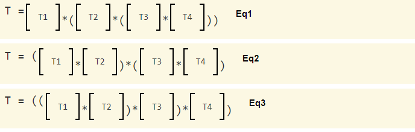

# 6.11 - More Matrix Math Concepts

在离开有关变换的课程之前，让我们回顾一下与矩阵代数相关的一些重要概念。

## Order Matters!

在数学中，如果一系列运算可以按任何顺序执行，我们称这些运算是“可交换的”。例如，数字的乘法是可交换的，因为乘法可以按任何顺序进行。

```javascript
// These 3 statements calculate the same answer; multiplication of numbers is commutative
a = 3 * 4 * 7 * 10;
b = 10 * 7 * 4 * 3;
c = 4 * 10 * 7 * 3;
```

然而，在矩阵代数中，乘法是不可交换的。乘数的顺序很重要。如果你改变顺序，你会得到不同的结果。

## Matrix Multiplication is Associative

在数学中，如果一系列运算可以以不同的方式分组，但仍然得到相同的结果，则这些运算是“结合的”。例如，数字的乘法是结合的，因为执行操作的顺序无关紧要。

```javascript
// These 3 statements calculate the same answer; multiplication of numbers is associative
a = (3 * 4) * (7 * 10);
b = 3 * ((4 * 7) * 10);
c = ((3 * 4) * 7) * 10;
```

在矩阵代数中，乘法是结合的！这意味着无论您执行第一次、第二次或第三次哪种乘法，你都会得到相同的结果。对于以下三个示例等式，如果先执行括号中的乘法运算，则 T 会得到相同的结果。



实际上矩阵的乘法是结合的，这一事实使我们能够将一系列变换组合成一个 4×4 变换矩阵。我们可以将一个顶点乘以一系列单独的矩阵，但这在计算上会很昂贵。如果我们将所有变换组合成一个变换，我们将在渲染速度方面获得巨大优势。这就是我们通常所做的！

## Transforms Are Relative

但事情并不像看起来那么简单。从概念上讲，程序员必须将变换分开，因为每个变换实际上都在处理不同的模型！让我们用一个例子来解释这种情况。假设你有一个模型正在由五个不同的矩阵进行转换，如下所示：


从概念上讲，矩阵 T5 首先应用于模型，现在模型的每个顶点都有不同的值。矩阵 T4 现在正在转换变换后的模型。这个逻辑适用于每个后续的乘法。为了使这个想法更具体，假设变换 T5 是一个缩放操作，它将模型的顶点从英尺单位更改为英寸。 T5 将是这个缩放矩阵：


由于 T5 改变了模型的概念单位，所有其他变换必须在概念上以英尺为单位，而不是英寸，因为它们现在作用于转换后的模型！

总之，当你创建一个变换矩阵时，你必须考虑它之前的变换。当我们研究投影变换时，我们会看到更多这样的例子。