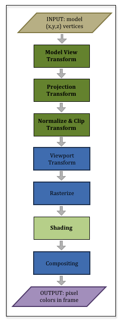

6.7 - Using `Learn_webgl_matrix` - A Robot Arm Base

本课介绍了一个示例 WebGL 程序，该程序使用 `Learn_webgl_matrix` JavaScript 类来创建和操作转换矩阵。当你渲染一个场景时，有一个预处理步骤来初始化你的上下文和单独的步骤来渲染一个单独的帧。我们将分别讨论这两个主要问题。

这个例子将在接下来的几节课中得到加强，所以在继续下一课之前，请确保你理解了这个例子。

## The Graphics Pipeline (Review)

我们在之前的课程中讨论了图形管道，但我们需要回顾一下管道是如何工作的。管道中的前 3 个操作是完成以下任务的转换：

1. 模型视图转换：这实际上是两个独立且不同的操作：
    * 模型转换：将模型转换为正确的大小、位置和方向。
    * 视图变换：将模型变换为场景摄像机前的正确位置和方向。
2. 投影变换：变换模型以将其从 3 维空间投影到 2 维查看窗口。
3. 归一化和裁剪变换：变换模型以便如果它不在场景相机的视图框架中，它可以很容易地被丢弃。（这称为“剪裁”，因为模型的一部分可能可见，而另一部分可能不可见。）



了解以下“big ideas”很重要：
* 所有这些变换操作都由一个 4×4 变换矩阵执行。
* 你必须始终包括所有这些转换。它们对图形管道都很重要。
* 有太多细节无法同时讨论所有这些转换。本课将重点介绍模型转换。其他转换将在以后的课程中充分解释。（在下面的演示代码中，我们将“神奇地”创建一个视图变换和一个投影变换（其中包括规范化和剪辑变换。现在，只需认识到这些变换是必须的。）

通常的做法是将模型、视图和投影变换组合成一个 4×4 变换矩阵，这样顶点着色器只需将每个顶点相乘一次。此演示代码创建了这样一个组合转换。请记住，转换顺序必须从右到左。实际上，你开发的每个 WebGL 程序都会创建一个顶点变换矩阵，如下所示：

```javascript
VertexTransform = | ProjectionMatrix | * | ViewMatrix| * | ModelMatrix |
```

## Scene Rendering Initialization

使用良好的软件开发设计原则，我们创建了一个 JavaScript 类来封装渲染场景所需的功能。该类的构造函数将执行场景初始化。构造函数所有代码包含在非类内子函数中。因为我们使用JavaScript的 `"use strict"`模式，所有变量和函数都必须先定义后才能使用。这会导致构造函数代码分布在整个类定义中。研究以下示例代码，然后查看以下代码的描述。注意，画布窗口包含单个模型的渲染，该模型是机械臂的基础。这是后续课程中介绍的一系列演示程序的第一次迭代。

```javascript
/**
 * simple_transform_example_render.js, By Wayne Brown, Spring 2016*
 */

/**
 * The MIT License (MIT)
 *
 * Copyright (c) 2015 C. Wayne Brown
 *
 * Permission is hereby granted, free of charge, to any person obtaining a copy
 * of this software and associated documentation files (the "Software"), to deal
 * in the Software without restriction, including without limitation the rights
 * to use, copy, modify, merge, publish, distribute, sublicense, and/or sell
 * copies of the Software, and to permit persons to whom the Software is
 * furnished to do so, subject to the following conditions:
 *
 * The above copyright notice and this permission notice shall be included in all
 * copies or substantial portions of the Software.

 * THE SOFTWARE IS PROVIDED "AS IS", WITHOUT WARRANTY OF ANY KIND, EXPRESS OR
 * IMPLIED, INCLUDING BUT NOT LIMITED TO THE WARRANTIES OF MERCHANTABILITY,
 * FITNESS FOR A PARTICULAR PURPOSE AND NONINFRINGEMENT. IN NO EVENT SHALL THE
 * AUTHORS OR COPYRIGHT HOLDERS BE LIABLE FOR ANY CLAIM, DAMAGES OR OTHER
 * LIABILITY, WHETHER IN AN ACTION OF CONTRACT, TORT OR OTHERWISE, ARISING FROM,
 * OUT OF OR IN CONNECTION WITH THE SOFTWARE OR THE USE OR OTHER DEALINGS IN THE
 * SOFTWARE.
 */

"use strict";

//-------------------------------------------------------------------------
/**
 * Initialize and render a scene.
 * @param learn Learn_webgl An instance of Learn_webgl
 * @param vshaders_dictionary Object a set of vertex shaders
 * @param fshaders_dictionary Object a set of fragment shaders
 * @param models Object a set of models
 * @param controls Array a list of control id's
 * @constructor
 */
window.SceneSimpleExampleRender = function (learn, vshaders_dictionary,
                                         fshaders_dictionary, models, controls) {

  // Private variables
  var self = this; // Store a local reference to the new object.

  var out = learn.out;
  var events;
  var canvas;

  var gl = null;
  var program = null;
  var render_models = {};

  var matrix = new Learn_webgl_matrix();
  var transform = matrix.create();
  var projection = matrix.createOrthographic(-8, 8, -8, 8, -8, 8);
  var view = matrix.create();
  var base_y_rotate = matrix.create();

  // We don't have a real view transform at this time, but we want to look
  // down on the model, so we will rotate everything by 10 degrees.
  matrix.rotate(view, 10, 1, 0, 0);

  // Public variables that will be changed by event handlers or that
  // the event handlers need access to.
  self.canvas_id = learn.canvas_id;
  self.base_y_angle = 0.0;
  self.animate_active = true;

  //-----------------------------------------------------------------------
  // Public function to render the scene.
  self.render = function () {

    // Clear the entire canvas window background with the clear color and
    // the depth buffer to perform hidden surface removal.
    gl.clear(gl.COLOR_BUFFER_BIT | gl.DEPTH_BUFFER_BIT);

    // The base is being rotated by the animation callback so the rotation
    // about the y axis must be calculated on every frame.
    matrix.rotate(base_y_rotate, self.base_y_angle, 0, 1, 0);

    // Combine the transforms into a single transformation
    matrix.multiplySeries(transform, projection, view, base_y_rotate);

    // Draw the models
    render_models.base.render(transform);
  };

  //-----------------------------------------------------------------------
  // Public function to delete and reclaim all rendering objects.
  self.delete = function () {
    // Clean up shader programs
    gl.deleteShader(program.vShader);
    gl.deleteShader(program.fShader);
    gl.deleteProgram(program);
    program = null;

    // Delete each model's buffer objects
    render_models.base.delete();
    render_models = null;

    // Disable any animation
    self.animate_active = false;

    // Remove all event handlers
    events.removeAllEventHandlers();
    events = null;

    // Release the GL graphics context
    gl = null;
  };

  //-----------------------------------------------------------------------
  // Object constructor. One-time initialization of the scene.

  // Get the rendering context for the canvas
  canvas = learn.getCanvas(self.canvas_id);
  if (canvas) {
    gl = learn.getWebglContext(canvas);
    if (!gl) {
      return;
    }
  }

  // Enable hidden-surface removal
  gl.enable(gl.DEPTH_TEST);

  // Set up the rendering shader program and make it the active shader program
  program = learn.createProgram(gl, vshaders_dictionary.shader05, fshaders_dictionary.shader05);
  gl.useProgram(program);

  // Create the Buffer Objects needed for this model and copy
  // the model data to the GPU.
  render_models.base = new Learn_webgl_model_render_05(gl, program, models.Base, out);

  // Set up callbacks for the user and timer events
  events = new SimpleTransformExampleEvents(self, controls);
  events.animate();
};

```

关于执行构造函数代码时发生的预处理操作如下：

| Lines | description |
|------------|--------|
| 33-42   | 类函数。 `Learn_webgl` 对象（learn 参数）已下载所有必需的文件，并将该对象发送给着色器程序、模型和供用户输入的 HTML 输入元素列表。|
| 45-69, 114-139 | 类构造函数。此代码在创建对象时执行一次。它初始化渲染场景所需的所有数据。 |
| 55   | 创建 `Learn_webgl_matrix` 对象的一个​​实例。这使你可以访问我们在上一课中讨论的所有矩阵功能。 |
| 56-59 | 创建和初始化我们需要的变换矩阵 |
| 118-124 | 检索画布窗口的 GL 上下文。 |
| 130   | 使用顶点着色器和片段着色器创建着色器程序。 |
| 131   | 着色器程序成为活动图形管线程序。 |
| 135   | 在 GPU 中创建缓冲区对象，并将模型数据复制到 GPU。 |
| 138   | 初始化用户事件的回调。 |

## Rendering a Single Frame

每次场景需要渲染时，都会调用第 73-87 行的`render`函数。它采取以下主要行动：

| Lines | description |
|------------|--------|
| 77 | 保存当前渲染的图像的帧缓冲区被清除成背景颜色，并且将确定哪些像素可见的深度缓冲区被清除。|
| 80 | 计算导致基本模型旋转的旋转变换，因为旋转角度在每一帧上都会发生变化。|
| 84 | 计算单个顶点变换，其中包括投影、视图和模型变换。变换的顺序从右到左。从概念上讲，模型变换首先发生，然后是视图变换，最后是投影变换。|
| 87 | 使用计算的变换渲染模型。|

当你 “restart” 示例时，`Learn_webgl` 后台进程使用第 92-111 行中的 `delete` 函数。必须从内存中“清除”正在运行的程序，以便可以执行修改后的演示代码版本。你现在可以忽略删除功能。