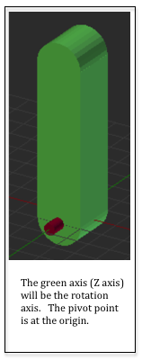

# 6.9 - Chaining Transformations - Adding an Upper Arm

上一课展示了一个带有一个连杆机构的机械臂。本课将演示如何将变换链接在一起以添加第二个链接。

## A Robot Arm - The Upper Arm

我们机器人的上臂是在 Blender 中创建的，其局部原点设置为 (0,0,0)，以便可以轻松旋转。它的旋转轴是 Z 轴。检查上臂的图像。



上臂将围绕前臂末端转动。但是旋转是关于原点的。我们需要将上臂绕原点旋转，然后将其移动到前臂的末端。但是前臂和底座都在旋转。那么我们如何将上臂放到正确的位置呢？我们使用定位前臂的变换！这是我们需要应用到上臂的变换，顺序如下：

1. 将其围绕其红色销旋转到所需的角度。
2. 将其平移到前臂的末端。
3. 根据前臂的角度旋转它。
4. 把它平移到底座的红色销轴。
5. 根据底座的旋转角度旋转

上臂的变换需要如下：

```javascript
modelTransform = | baseRotation | * | translateToPin | * | rotateForearm | * | translateToForearmEnd | * | rotateUpperarm |
```

希望你在这里看到一个模式！

## Scene Rendering Initialization

面的演示程序是上一课代码的修改版本。它为机器人手臂增加了一个“上臂”模型。我们需要两个新的变换矩阵来操纵上臂。一次变换将围绕其枢轴销旋转手臂。旋转可能会在每个新帧上发生变化，因此该矩阵将在初始化代码中创建，但在帧渲染函数中分配其值。平移矩阵可以创建并赋值一次，因为到前臂末端的距离是一个常数并且永远不会改变。研究示例代码，然后查看下面的代码描述。如果您想进行实验，演示代码是可修改的。

```javascript
/**
 * simple_transform_example_render3.js, By Wayne Brown, Spring 2016*
 */

/**
 * The MIT License (MIT)
 *
 * Copyright (c) 2015 C. Wayne Brown
 *
 * Permission is hereby granted, free of charge, to any person obtaining a copy
 * of this software and associated documentation files (the "Software"), to deal
 * in the Software without restriction, including without limitation the rights
 * to use, copy, modify, merge, publish, distribute, sublicense, and/or sell
 * copies of the Software, and to permit persons to whom the Software is
 * furnished to do so, subject to the following conditions:
 *
 * The above copyright notice and this permission notice shall be included in all
 * copies or substantial portions of the Software.

 * THE SOFTWARE IS PROVIDED "AS IS", WITHOUT WARRANTY OF ANY KIND, EXPRESS OR
 * IMPLIED, INCLUDING BUT NOT LIMITED TO THE WARRANTIES OF MERCHANTABILITY,
 * FITNESS FOR A PARTICULAR PURPOSE AND NONINFRINGEMENT. IN NO EVENT SHALL THE
 * AUTHORS OR COPYRIGHT HOLDERS BE LIABLE FOR ANY CLAIM, DAMAGES OR OTHER
 * LIABILITY, WHETHER IN AN ACTION OF CONTRACT, TORT OR OTHERWISE, ARISING FROM,
 * OUT OF OR IN CONNECTION WITH THE SOFTWARE OR THE USE OR OTHER DEALINGS IN THE
 * SOFTWARE.
 */

"use strict";

//-------------------------------------------------------------------------
/**
 * Initialize and render a scene.
 * @param learn Learn_webgl An instance of Learn_webgl
 * @param vshaders_dictionary Object a set of vertex shaders
 * @param fshaders_dictionary Object a set of fragment shaders
 * @param models Object a set of models
 * @param controls Array a list of control id's
 * @constructor
 */
window.SceneSimpleExampleRender3 = function (learn, vshaders_dictionary,
                                         fshaders_dictionary, models, controls) {

  // Private variables
  var self = this; // Store a local reference to the new object.

  var out = learn.out;
  var events;
  var canvas;

  var gl = null;
  var program = null;
  var render_models = {};

  var matrix = new Learn_webgl_matrix();
  var transform = matrix.create();
  var projection = matrix.createOrthographic(-10, 10, -2, 18, -20, 20);
  var view = matrix.create();
  var base_y_rotate = matrix.create();
  var forearm_rotate = matrix.create();
  var forearm_translate = matrix.create();
  var upperarm_rotate = matrix.create();
  var upperarm_translate = matrix.create();

  // Set the forearm_translate to a constant translation along the Y axis
  matrix.translate(forearm_translate, 0, 2, 0);
  matrix.translate(upperarm_translate, 0, 8, 0);

  // We don't have a real view transform at this time, but we want to look
  // down on the model, so we will rotate everything by 10 degrees.
  matrix.rotate(view, 10, 1, 0, 0);

  // Public variables that will be changed by event handlers or that
  // the event handlers need access to.
  self.canvas_id = learn.canvas_id;
  self.base_y_angle = 0.0;
  self.forearm_angle = 0.0;
  self.upperarm_angle = 0.0;
  self.animate_active = true;

  //-----------------------------------------------------------------------
  // Public function to render the scene.
  self.render = function () {

    // Clear the entire canvas window background with the clear color and
    // the depth buffer to perform hidden surface removal.
    gl.clear(gl.COLOR_BUFFER_BIT | gl.DEPTH_BUFFER_BIT);

    // The base is being rotated by the animation callback so the rotation
    // about the y axis must be calculated on every frame.
    matrix.rotate(base_y_rotate, self.base_y_angle, 0, 1, 0);

    // Combine the transforms into a single transformation
    matrix.multiplySeries(transform, projection, view, base_y_rotate);

    // Draw the base model
    render_models.base.render(transform);

    // Set the rotation matrix for the forearm; rotate about the Z axis
    matrix.rotate(forearm_rotate, self.forearm_angle, 0, 0, 1);

    // Calculate the transform for the forearm
    matrix.multiplySeries(transform, projection, view, base_y_rotate,
        forearm_translate, forearm_rotate);

    // Draw the forearm model
    render_models.forearm.render(transform);

    // Set the rotation matrix for the upperarm; rotate about the Z axis
    matrix.rotate(upperarm_rotate, self.upperarm_angle, 0, 0, 1);

    // Calculate the transform for the upperarm
    matrix.multiplySeries(transform, projection, view, base_y_rotate,
        forearm_translate, forearm_rotate, upperarm_translate, upperarm_rotate);

    // Draw the upperarm model
    render_models.upperarm.render(transform);
  };

  //-----------------------------------------------------------------------
  // Public function to delete and reclaim all rendering objects.
  self.delete = function () {
    // Clean up shader programs
    gl.deleteShader(program.vShader);
    gl.deleteShader(program.fShader);
    gl.deleteProgram(program);
    program = null;

    // Delete each model's buffer objects
    render_models.base.delete();
    render_models.forearm.delete();
    render_models.upperarm.delete();
    render_models = null;

    // Disable any animation
    self.animate_active = false;

    // Remove all event handlers
    events.removeAllEventHandlers();
    events = null;

    // Release the GL graphics context
    gl = null;
  };

  //-----------------------------------------------------------------------
  // Object constructor. One-time initialization of the scene.

  // Get the rendering context for the canvas
  canvas = learn.getCanvas(self.canvas_id);
  if (canvas) {
    gl = learn.getWebglContext(canvas);
    if (!gl) {
      return;
    }
  }

  // Enable hidden-surface removal
  gl.enable(gl.DEPTH_TEST);

  // Set up the rendering shader program and make it the active shader program
  program = learn.createProgram(gl, vshaders_dictionary.shader05, fshaders_dictionary.shader05);
  gl.useProgram(program);

  // Create the Buffer Objects needed for this model and copy
  // the model data to the GPU.
  render_models.base = new Learn_webgl_model_render_05(gl, program, models.Base, out);
  render_models.forearm = new Learn_webgl_model_render_05(gl, program, models.Forearm, out);
  render_models.upperarm = new Learn_webgl_model_render_05(gl, program, models.Upperarm, out);

  // Set up callbacks for the user and timer events
  events = new SimpleTransformExampleEvents3(self, controls);
  events.animate();
};

```

关于执行构造函数代码时发生的预处理操作：

| Lines | description |
|------------|--------|
| 62-63 | 创建了两个新的变换来操纵前臂。|
| 67 | 上臂的平移设置为沿 Y 轴的 8 个常数单位。 |
| 78 | 创建一个类变量来存储上臂的角度。它是公开的，因此 HTML 滑块事件处理程序可以更改其值。 |
| 169 | 在 GPU 中创建缓冲区对象，并将模型数据复制到 GPU 用于上臂模型。 |

## Rendering a Single Frame

每次场景需要渲染时，都会调用第 83-117 行的 `render` 函数。此功能与之前的演示版本相同，但有以下例外：

| Lines | description |
|------------|--------|
| 110 | 设置上臂的旋转矩阵是因为前臂的旋转可以在每一帧上改变。|
| 113-114 | 计算上臂的变换。请注意，包括基本旋转和前臂变换。还要注意从右到左的变换顺序。转换的顺序很关键。|
| 117 | 使用计算的变换来渲染上臂模型。|
