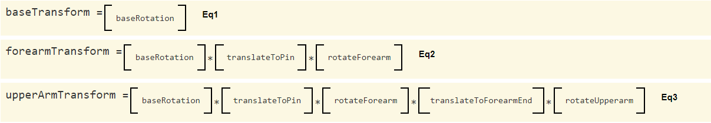

# 6.10 - Chaining Transformations (Summary)

上一课展示了一个带有两个连杆机构的机械臂。这演示了如何将矩阵变换链接在一起以创建复杂的运动。渲染变换的创建是被明确的创建，以使它清楚如何创建转换。以下是转换和创建它们的代码摘要：



```javascript
// For rendering the base
matrix.multiplySeries(transform, projection, view, base_y_rotate);

// For rendering the forearm
matrix.multiplySeries(transform, projection, view, base_y_rotate,
                      forearm_translate, forearm_rotate);

// For rendering the upper arm
matrix.multiplySeries(transform, projection, view, base_y_rotate,
                      forearm_translate, forearm_rotate,
                      upperarm_translate, upperarm_rotate);
```

## Reusing Transformations

矩阵的乘法是一项昂贵的操作。对于4 x 4 的矩阵，乘法需要64次乘法和48次加法。们希望尽可能避免重复的矩阵乘法。对于机械臂来说，不需要一遍又一遍地重复相同的矩阵乘法。我们可以重用之前的变换并简单地对附加变换进行后乘。代码中每个转换的创建可以这样完成：

```javascript
// For rendering the base
matrix.multiplySeries(transform, projection, view, base_y_rotate);

// For rendering the forearm
matrix.multiplySeries(transform, transform, forearm_translate, forearm_rotate);

// For rendering the upper arm
matrix.multiplySeries(transform, transform, upperarm_translate, upperarm_rotate);
```

请注意，在第二个和第三个函数调用中，第二个参数是之前计算的 `transform` 值。以下演示代码包含这些简化的计算。

重用变换计算对于复杂的渲染很重要，但在你完全清楚如何构建复杂的变换链之前，不应折叠变换计算。首先，让 WebGL 程序正常工作。如果渲染缓慢是一个问题，你可以随时进行效率优化。

```javascript
/**
 * simple_transform_example_render4.js, By Wayne Brown, Spring 2016*
 */

/**
 * The MIT License (MIT)
 *
 * Copyright (c) 2015 C. Wayne Brown
 *
 * Permission is hereby granted, free of charge, to any person obtaining a copy
 * of this software and associated documentation files (the "Software"), to deal
 * in the Software without restriction, including without limitation the rights
 * to use, copy, modify, merge, publish, distribute, sublicense, and/or sell
 * copies of the Software, and to permit persons to whom the Software is
 * furnished to do so, subject to the following conditions:
 *
 * The above copyright notice and this permission notice shall be included in all
 * copies or substantial portions of the Software.

 * THE SOFTWARE IS PROVIDED "AS IS", WITHOUT WARRANTY OF ANY KIND, EXPRESS OR
 * IMPLIED, INCLUDING BUT NOT LIMITED TO THE WARRANTIES OF MERCHANTABILITY,
 * FITNESS FOR A PARTICULAR PURPOSE AND NONINFRINGEMENT. IN NO EVENT SHALL THE
 * AUTHORS OR COPYRIGHT HOLDERS BE LIABLE FOR ANY CLAIM, DAMAGES OR OTHER
 * LIABILITY, WHETHER IN AN ACTION OF CONTRACT, TORT OR OTHERWISE, ARISING FROM,
 * OUT OF OR IN CONNECTION WITH THE SOFTWARE OR THE USE OR OTHER DEALINGS IN THE
 * SOFTWARE.
 */

"use strict";

//-------------------------------------------------------------------------
/**
 * Initialize and render a scene.
 * @param learn Learn_webgl An instance of Learn_webgl
 * @param vshaders_dictionary Object a set of vertex shaders
 * @param fshaders_dictionary Object a set of fragment shaders
 * @param models Object a set of models
 * @param controls Array a list of control id's
 * @constructor
 */
window.SceneSimpleExampleRender4 = function (learn, vshaders_dictionary,
                                         fshaders_dictionary, models, controls) {

  // Private variables
  var self = this; // Store a local reference to the new object.

  var out = learn.out;
  var events;
  var canvas;

  var gl = null;
  var program = null;
  var render_models = {};

  var matrix = new Learn_webgl_matrix();
  var transform = matrix.create();
  var projection = matrix.createOrthographic(-10, 10, -2, 18, -20, 20);
  var view = matrix.create();
  var base_y_rotate = matrix.create();
  var forearm_rotate = matrix.create();
  var forearm_translate = matrix.create();
  var upperarm_rotate = matrix.create();
  var upperarm_translate = matrix.create();

  // Set the forearm_translate to a constant translation along the Y axis
  matrix.translate(forearm_translate, 0, 2, 0);
  matrix.translate(upperarm_translate, 0, 8, 0);

  // We don't have a real view transform at this time, but we want to look
  // down on the model, so we will rotate everything by 10 degrees.
  matrix.rotate(view, 10, 1, 0, 0);

  // Public variables that will be changed by event handlers or that
  // the event handlers need access to.
  self.canvas_id = learn.canvas_id;
  self.base_y_angle = 0.0;
  self.forearm_angle = 0.0;
  self.upperarm_angle = 0.0;
  self.animate_active = true;

  //-----------------------------------------------------------------------
  // Public function to render the scene.
  self.render = function () {

    // Clear the entire canvas window background with the clear color and
    // the depth buffer to perform hidden surface removal.
    gl.clear(gl.COLOR_BUFFER_BIT | gl.DEPTH_BUFFER_BIT);

    // The base is being rotated by the animation callback so the rotation
    // about the y axis must be calculated on every frame.
    matrix.rotate(base_y_rotate, self.base_y_angle, 0, 1, 0);

    // Combine the transforms into a single transformation
    matrix.multiplySeries(transform, projection, view, base_y_rotate);

    // Draw the base model
    render_models.base.render(transform);

    // Set the rotation matrix for the forearm; rotate about the Z axis
    matrix.rotate(forearm_rotate, self.forearm_angle, 0, 0, 1);

    // Calculate the transform for the forearm
    matrix.multiplySeries(transform, transform, forearm_translate, forearm_rotate);

    // Draw the forearm model
    render_models.forearm.render(transform);

    // Set the rotation matrix for the upperarm; rotate about the Z axis
    matrix.rotate(upperarm_rotate, self.upperarm_angle, 0, 0, 1);

    // Calculate the transform for the upperarm
    matrix.multiplySeries(transform, transform, upperarm_translate, upperarm_rotate);

    // Draw the upperarm model
    render_models.upperarm.render(transform);
  };

  //-----------------------------------------------------------------------
  // Public function to delete and reclaim all rendering objects.
  self.delete = function () {
    // Clean up shader programs
    gl.deleteShader(program.vShader);
    gl.deleteShader(program.fShader);
    gl.deleteProgram(program);
    program = null;

    // Delete each model's buffer objects
    render_models.base.delete();
    render_models.forearm.delete();
    render_models.upperarm.delete();
    render_models = null;

    // Disable any animation
    self.animate_active = false;

    // Remove all event handlers
    events.removeAllEventHandlers();
    events = null;

    // Release the GL graphics context
    gl = null;
  };

  //-----------------------------------------------------------------------
  // Object constructor. One-time initialization of the scene.

  // Get the rendering context for the canvas
  canvas = learn.getCanvas(self.canvas_id);
  if (canvas) {
    gl = learn.getWebglContext(canvas);
    if (!gl) {
      return;
    }
  }

  // Enable hidden-surface removal
  gl.enable(gl.DEPTH_TEST);

  // Set up the rendering shader program and make it the active shader program
  program = learn.createProgram(gl, vshaders_dictionary.shader05, fshaders_dictionary.shader05);
  gl.useProgram(program);

  // Create the Buffer Objects needed for this model and copy
  // the model data to the GPU.
  render_models.base = new Learn_webgl_model_render_05(gl, program, models.Base, out);
  render_models.forearm = new Learn_webgl_model_render_05(gl, program, models.Forearm, out);
  render_models.upperarm = new Learn_webgl_model_render_05(gl, program, models.Upperarm, out);

  // Set up callbacks for the user and timer events
  events = new SimpleTransformExampleEvents4(self, controls);
  events.animate();
};

```