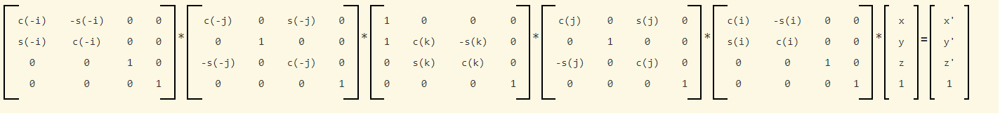
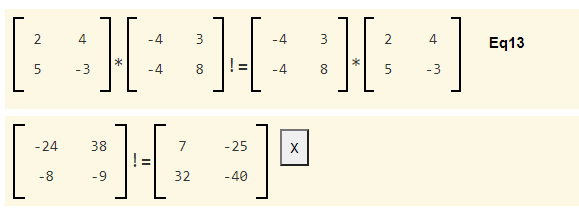
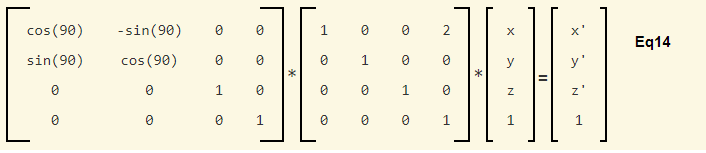
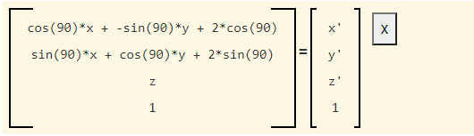
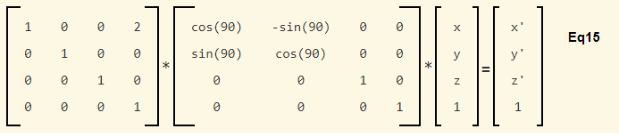
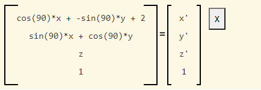
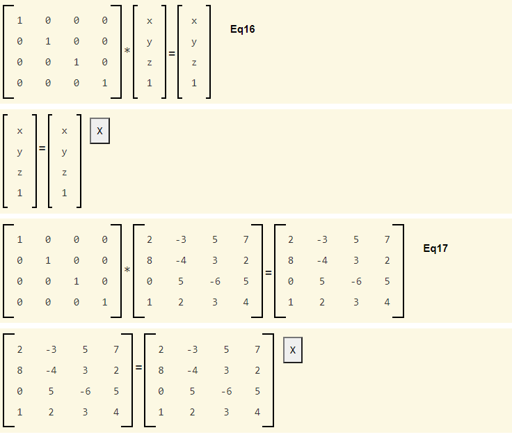
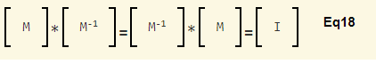
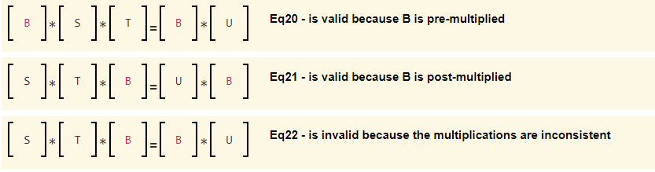
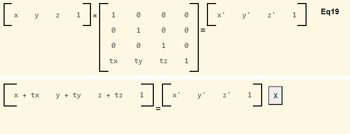

# 6.5 - Transformation Matrices

前三个课程介绍了应用在模型上的基本变换：平移，缩放和旋转。这些变换可以组合起来产生负载的运动。但是我们需要一个简单且有效的方法将这些变换组合起来。解决方案就是矩阵。

本课将回顾矩阵数学的基础知识，并向你展示如何使用矩阵组合变换。矩阵用于几乎所有的计算机图形计算，包括相机的操作和将 3D 场景投影到 2D 视窗上。因此，这是你需要掌握的知识的关键部分。

本教程的目的不是为这些概念提供数学证明，而是为你提供如何使用矩阵数学创建计算机图形的坚实基础。如果你想接受正规的矩阵数学教育，我建议你在卡恩学院学习线性代数课程，但掌握计算机图形学不需要这种专业水平。

## Matrix Basics

通过从变量中分离出方程的系数，可以将方程组写成矩阵格式。让我们将旋转的一般方程转换为矩阵形式。请注意，x、y 和 z 值是我们的“变量”，fn 值是方程项的“系数”。要为计算机图形场景操作图形模型，我们将通过选择适当的 fn 值来创建变换，然后将变换应用于模型中的每个顶点。fn 值对于单帧动画的渲染是恒定的，但它们通常会在下一帧动画时发生变化。

方程：

```javascript
f1*x + f2*y + f3*z = x'
f4*x + f5*y + f6*z = y'
f7*x + f8*y + f9*z = z'
```

在矩阵格式中看起来像这样：

```javascript
| f1 f2 f3 |   | x |    | x' |
| f4 f5 f6 | * | y | =  | y' |
| f7 f8 f9 |   | z |    | z' |
```

这些教程中介绍的矩阵方程可以通过单击方程中的运算符符号来执行。现在通过单击上面等式中的乘法符号来尝试一下。新版本的方程将显示在原始方程的下方，其中运算符号之前和之后的矩阵已被作为运算结果的单个矩阵替换。矩阵相乘如下：结果中的每个元素是通过将左侧矩阵的相应行和右侧矩阵的相应列相乘并将各个相应元素相乘然后将各项相加来计算的。如果将光标放在新显示的矩阵中的任何元素上，则用于计算该术语的相应行和列将在原始矩阵中突出显示。如果矩阵包含数字而不是符号，也许更容易将这些问题可视化。通过单击乘法符号执行下面的矩阵乘法，然后将鼠标悬停在结果的每个项上。

```javascript
| f1 f2 f3 |   | x |    | x' |
| f4 f5 f6 | * | y | =  | y' |
| f7 f8 f9 |   | z |    | z' |
```

结果中有意显示了用于计算每个项的方程，以便你可以看到每个值的来源。选择等式右侧的“-”按钮会将每个项减少为其最简单的计算值。请在这些教程中使用此功能来仔细检查矩阵的工作原理。如果你单击等式中的等号，则等式的每一边都将简化为最简单的形式。右侧的“X”按钮将从网页中删除生成的方程式。

## Basic Transformations In Matrix Format

从上一课中你了解到，缩放变换是通过像这样将顶点分量相乘来执行的，其中 (x,y,z) 是一个顶点，而 (x',y',z') 是一个变换后的顶点：

```javascript
x * sx = x'
y * sy = y'
z * sz = z'
```

这些缩放方程可以写成矩阵格式，如下所示：

```javascript
| sx 0  0  |   | x |    | x' |
| 0  sy 0  | * | y | =  | y' |
| 0  0  sz |   | z |    | z' |
```

将矩阵相乘并缩小方程以查看等价性。采用这样简单的方程并通过使用矩阵使它们变得更复杂，这似乎很疯狂。但是你很快就会看到矩阵的威力。

旋转变换可以很容易地以矩阵格式编写。让我们将绕 Z 轴旋转的方程以矩阵格式表示：

```javascript
x * cos(angle) + y * -sin(angle) = x'
x * sin(angle) + y *  cos(angle) = y'
                               z = z'
```

```javascript
| cos(angle) -sin(angle)  0  |   | x |    | x' |
| sin(angle) cos(angle)   0  | * | y | =  | y' |
| 0          0            1  |   | z |    | z' |
```

现在我们来到了难点 - 平移。注意在之前的每个例子中，每个顶点分量的变换是原始x, y, z值的某种组合。但是对于平移来说，我们简单的希望为每个分量加一个值。到目前为止，我们使用的矩阵无法做到这一点。所以我们需要一个更大的矩阵。我们使用 4 x 4 矩阵代替 3 x 3 矩阵，如下所示：

平移方程如下：

```javascript
x + tx = x'
y + ty = y'
z + tz = z'
```

矩阵格式的等效方程为：

```javascript
| 1  0  0  tx |   | x |    | x' |
| 0  1  0  ty | * | y | =  | y' |
| 0  0  1  tz |   | z |    | z' |
| 0  0  0  1  |   | 1 |    | 1  |
```

运算结果：

```javascript
| x + tx |   | x' |
| y + ty | = | y' |
| z + tz |   | z' |
|   1    |   | 1  |
```

让我们对这个矩阵乘法做一些观察：
* 在(x,y,z) 列向量的末尾添加值为 1 的附加分量，保证了偏移量 (tx, ty, tz) 将保持不变。
* 对角线的 1 （三个1) 确保原始的(x, y, z)值被包含在结果中，并保持不变。
* 变换矩阵的最后一行（0， 0， 0， 1）保证(x, y, z)的值末尾的 1 分量在结果中保持为 1。

疑问，我们知否真的需要变换矩阵的最后一行？我们可以这样吗？

```javascript
| 1  0  0  tx |   | x |    | x' |
| 0  1  0  ty | * | y | =  | y' |
| 0  0  1  tz |   | z |    | z' |
                  | 1 |
```

运算结果：

```javascript
| x + tx |   | x' |
| y + ty | = | y' |
| z + tz |   | z' |
```

从纯数学的角度来看，是的，你可以。然而，我们的目标是创建一个单一的、一致的格式来应用一系列转换。此外，我们需要撤消（或反向）转换的能力，这要求我们的转换矩阵是正方形的。因此，变换矩阵中的第 4 行是必须的。

在顶点的末尾添加额外值,末尾添加 1 , 称为齐次坐标(homogeneous coordinate)。标准约定是将此项称为 `w` 分量。因此，齐次坐标中的顶点看起来像这样 (x,y,z,w)。`w` 分量不仅仅用于平移，我们将在以后的课程中讨论这些用途。但是现在，请注意 `w` 分量实现（和控制）平移。对于顶点，我们总是希望 `w` 分量的值是 1。但是，请记住，矢量有大小和方向，但没有位置。一个向量不能被平移。当我们使用齐次坐标表示向量时，`w` 值必须为零！由于我们很少将同构组件存储在内存中以减少内存使用，你必须在需要时添加同质组件。只要记住：
* 对于顶点使用 (x,y,z,1)，它允许缩放、旋转和平移。
* 对于向量，使用 <dx,dy,dz,0>，它允许缩放和旋转（但不能平移）。

将所有这些放在一起为我们提供了以下一致的（consistent）方式来执行我们的三个基本转换：

缩放（Scale）:

```javascript
| sx 0  0  0 |   | x |    | x' |
| 0  sy 0  0 | * | y | =  | y' |
| 0  0  sz 0 |   | z |    | z' |
| 0  0  0  1 |   | 1 |    | 1  |
```

平移(Translate):

```javascript
| 1  0  0  tx |   | x |    | x' |
| 0  1  0  ty | * | y | =  | y' |
| 0  0  1  tz |   | z |    | z' |
| 0  0  0  1  |   | 1 |    | 1  |
```

绕 z 轴旋转角度:

```javascript
| cos(angle) -sin(angle)  0  0 |   | x |    | x' |
| sin(angle) cos(angle)   0  0 | * | y | =  | y' |
| 0          0            1  0 |   | z |    | z' |
| 0          0            0  1 |   | 1 |    | 1  |
```

绕 y 轴旋转角度:

```javascript
| cos(angle)  0  sin(angle)  0 |   | x |    | x' |
| 0           1  0           0 | * | y | =  | y' |
| -sin(angle) 0  cos(angle)  0 |   | z |    | z' |
| 0           0  0           1 |   | 1 |    | 1  |
```

绕 x 轴旋转角度:

```javascript
| 1  0           0            0 |   | x |    | x' |
| 0  cos(angle)  -sin(angle)  0 | * | y | =  | y' |
| 0  sin(angle)  cos(angle)   0 |   | z |    | z' |
| 0  0           0            1 |   | 1 |    | 1  |
```

绕由 <ux,uy,uz> 定义的任意轴进行旋转：

让我们通过组合我们已经创建的变换公式来推导出围绕任何轴旋转的变换公式。这将为你提供一个示例，说明如何组合基本变换以形成更复杂的变换。如果我们想要绕某一轴进行旋转，这个轴由<ux, uy, uz>定义，那么我们可以通过执行以下一系列变换来实现：

1. 绕 z 轴旋转是将矢量 <ux, uy, uz> 放置到 z-x 平面上。我们将这个新的矢量称为 <ux’, uy’, uz’> 。
2. 然后绕 Y 轴旋转，沿 X 轴放置 <ux', uy', uz'>
3. 然后绕 X 轴旋转所需的角度。
4. 然后绕 Y 轴旋转，将 <ux', uy', uz'> 放回原来的位置。
5. 然后绕 Z 轴旋转以将 <ux, uy, uz> 放回其原始位置。

这一系列 5 次旋转将提供围绕轴 <ux,uy,uz> 旋转模型的视觉效果。但是我们不想对每个顶点一遍又一遍地进行所有 5 次变换。我们想要一个能够产生我们想要的视觉运动的单一转换。我们可以通过在开始渲染之前将 5 个矩阵相乘来实现这一点，然后使用单个变换矩阵来执行所需的旋转。为了明确这个想法，让我们按照指定的顺序执行上面的 5 个转换。顺序很关键，因为如果你改变顺序，你会得到一个非常不同的结果。

我们需要计算 2 个旋转角度，使旋转轴与 X 轴对齐。设 `i` 为第一步的角度，`j` 为第二步的角度，`k` 为第三步的角度。让我们使用 `s()` 和 `c()` 来表示 `sin` 和 `cosine` 函数。转换如下所示：



执行上述等式中的矩阵乘法以查看单个变换等于什么。请注意，得到的答案是 sin 和 cos 函数，因为方程不包含特定的数值，但在特定情况下，你将拥有一个 4×4 矩阵，其中包含 16 个数值，可以执行所需的转换。如果你要转换的模型包含 10,000 个顶点，则将复杂的转换减少为单个 4×4 矩阵可以节省大量计算量。

应该注意的是，可以通过组合上述等式中的类似项，使用更简单的等式计算绕轴 <ux, uy, uz> 的旋转。对于常见的操作，例如围绕特定轴旋转，在将其编程为算法之前，计算会被简化为最简单的形式。但对于一般情况，复杂运动将通过形成一系列 4x4 矩阵变换并将它们组合成单个变换矩阵来创建。

让我们看一下矩阵的一些基本性质。

## Basic Properties of Matrices - Order Matters!

矩阵表示方程组。因此，只有一小部分操作是有意义的。基本运算是乘法。我们在上面的讨论中定义了矩阵是如何相乘的。要理解的重要一点是乘法的顺序很重要。一般来说，`M1*M2 != M2*M1`。尝试以下示例。



从计算机图形学的角度来看，很容易理解矩阵顺序很重要。例如，物理上取某个对象，假设它位于原点，并对其执行以下变换：

1. 将其沿 X 轴向下移动 2 个单位。
2. 然后绕 Z 轴旋转 90 度。

现在，以相反的顺序执行变换：

1. 将对象绕 Z 轴旋转 90 度。
2. 然后将其沿 X 轴向下移动 2 个单位。

该对象最终在一个完全不同的地方！

让我们以矩阵格式执行这些转换。下面的等式将对象沿 x 轴向下移动 2 个单位，然后围绕 Z 轴旋转 90 度：



变换结果：



而下面这个方程首先执行旋转，然后执行平移：



变换结果：



将这两个方程相乘并化简，可以看到变换确实是完全不同的！最接近 (x,y,z,1) 向量的矩阵是最先发生的变换。然后向左边进行变换，以此类推。因此，你必须在计算中从右到左对转换进行排序，以获得所需的转换顺序。

## The Identity Matrix and the Matrix Inverse (单位矩阵和逆矩阵)

如果两个矩阵相乘，单位矩阵不会改变另一个矩阵的值。这与将单个值乘以 1 相同。尝试以下两个示例。



单位矩阵由大写字母 I 表示。

一个 4×4 矩阵对一组顶点进行变换。通常需要反转变换以恢复原始值。在代数中，撤销加法的方法是减法。例如，通过从两边减去 5 来检查如何将 5 移动到等式的另一边：

```javascript
x + 5 = x'
x + 5 - 5 = x' - 5
x = x' - 5
```

以类似的方式，撤消乘法的方法是除法（或乘以倒数）。例如，擦看乘以 5 的结果如何通过除以 5 移动到等式的另一边。

```javascript
x * 5 = x'
(x * 5) / 5 = x' / 5
x = x' / 5
x = x' * (1/5)
```

矩阵的除法是通过乘以矩阵逆(matrix inverse)来执行的。给定一个矩阵 M，如果你将它乘以它的逆矩阵，结果就是单位矩阵。符号 M<sup>-1</sup> 表示 M 的逆矩阵。矩阵的逆将产生一个单位矩阵，而不管矩阵乘法的顺序如何。那是，



任意 4×4 矩阵可能有也可能没有逆矩阵。但是，如果你创建一个结合了缩放、旋转或平移的变换，则生成的 4×4 矩阵将始终具有逆矩阵。我们将在后面的课程中讨论如何使用矩阵求逆。

矩阵数学遵循与代数相同的简单规则。如果你有一个方程，你必须总是在方程的两边执行相同的操作来保持它的相等性。但是，由于矩阵乘法的顺序很重要，如果你在等式的一侧乘以一个矩阵，请确保在等式的另一侧也乘以相同的矩阵。

```javascript
| S | * | T | = | U |

| S * T | = | U |
```

在接下来的方程操作中，第一个和第二个方程是有效的，而第三个是无效的。



## Matrix Conventions

计算机图形转换的基本问题是它们的顺序。正如我们已经讨论过的，这与矩阵乘法的顺序有关。按照惯例，WebGL（及其衍生的 OpenGL 系统）的转换顺序是从右到左。这是因为我们创建初始方程的方式。我们首先将转换矩阵定位在 (x,y,z,w) 顶点的左侧。还有另一种方法可以执行相同的乘法。你可以将 (x, y, z, w) 顶点放在等式的前面，如下所示：



请注意，上例中的平移矩阵必须将平移值移动到矩阵的最后一行。事实上，如果你对变换进行后乘（post-multiply），我们讨论过的每个变换矩阵（缩放除外）都会有不同的格式。如果你使用这个约定，转换应该是从左到右应用的，而不是从右到左。重要的是你选择一个约定并始终如一地使用它。永远不要混淆这个约定！在整个教程中，我们将使用前乘（pre-multiplying）变换乘以顶点的 WebGL/OpenGL 约定。

注意，很容易在网络上搜索并获得有关图形转换的相互冲突的信息，因为有两种方法可以构建转换，即前乘或后乘( pre-multiplying or post-multiplying)。OpenGL 使用前乘约定，而 Microsoft 的 Direct3D 使用后乘约定。因此，请确保你了解网页所采用的约定，以免你因信息冲突而感到困惑。