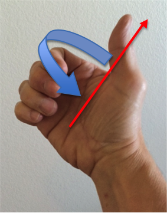

# 6.4 - Rotating

旋转会改变模型的方向。另外，如果模型是远离原点的，那么模型的位置也将被改变。数学上，旋转要求所有三个分量都要与每个分量的变换值参与计算。这些分量值都是内部连接的（inner-connected ）用来进行旋转。例如，对于平移和旋转，y 的值不会影响到 x 或 z 的值。但是对于旋转就不成立了。y 的值会影响到 x 或 z 的旋转值。旋转后的顶点的每个分量都是原始顶点的分量的一部分的组合。如果我们用 f1、f2、f3、f4、f5、f6、f7、f8 和 f9 来表示一组分数，那么旋转计算为：

```javascript
x' = x*f1 + y*f2 + z*f3;
y' = x*f4 + y*f5 + z*f6;
z' = x*f7 + y*f8 + z*f9;
```

必须特别的选择分数 f1、f2、f3、f4、f5、f6、f7、f8 和 f9 以产生圆周运动。

理解你总是围绕某物进行旋转的，这一点非常重要。也就是说，你始终有一个点和一条参考线，你围绕它们创建圆周运动。圆总是由一个中心点。另外，圆总是在一个平面上。平面可以由平面的表面法向量定义。因此，旋转总是围绕一个轴的旋转，这个圆包含了平面的法向量。因为所有的平移和缩放都是相遇于坐标系统的，因此所有的旋转都是相对于同样的坐标系统。假设旋转是始终围绕原点进行的数学运算。我们可以从简单的情况开始，然后研究更复杂的情况，来开发旋转的一般方程。

角度是有方向的。例如，你可以旋转45度或者-45度。那么哪种方式是正旋转，哪种方式是负旋转？为了与右手坐标系保持一致，我们使用“右手法则”来确定旋转方向。使用右手，将拇指从其他手指上移开。你的拇指代表旋转轴。你卷曲的手指就是正旋转的方向，就像图片中显示的那样。（如果你使用左手坐标系，你应该做同样的事情。）



角度总是相对于某物的。角度必须有一条参考线，这条参考线定义了零度角。坐标系的轴就是天然的参考线。因此
* x 轴定义了 z 轴的零度角
* y 轴定义了 x 轴的零度角
* z 轴定义了 y 轴的零度角

根据这些约定，请注意，将任何坐标轴旋转 90 度会将其中一个轴带到另一个轴的位置。
* 沿 z 轴旋转90度，会将 x 轴移动到 y 轴上。
* 沿 x 轴旋转90度，会将 y 轴移动到 z 轴上。
* 沿 y 轴旋转90度，会将 z 轴移动到 x 轴上。

这些都是我们同意的约定，但是这些约定形成了一个非常好的、一致的和统一的旋转系统。

## Special Cases and Effects

让我们来看看三个具体案例 - 围绕每个坐标系轴旋转。然后我们将使用这些特殊情况来开发围绕任何轴的旋转。请学习并尝试以下示例。在画布内单击并拖动鼠标光标以获取 3D 世界的各种视图。

1. 绕 z 轴旋转

首先，请注意，当你沿 z 轴旋转模型，每个顶点的 z 分量都保持不变，只有 x 和 y 分量发生变化。同时注意，当你沿 z 轴旋转90度，x 轴就变成了 y 轴。所以在 90 度时，x 分量变为 y 分量，y 分量变为 -x 分量。因为旋转构成一个圆圈，因此，旋转角度的`sine` 和 `cosine` 为我们提供了我们在值组合中需要的分数。计算可以很容易地显示为：

```javascript
x' = x * cos(angle) + y * -sin(angle);
y' = x * sin(angle) + y *  cos(angle);
z' = z;
```

2. 绕 x 轴旋转

这种情况类似于沿 z 轴的旋转，但是顶点的 x 分量都保持不变，只有 y 和 z 分量需要发生变化。同样，因为旋转形成一个圆，旋转角度的正弦和余弦为我们提供了我们需要的分数：

```javascript
x' = x;
y' = y * cos(angle) + z * -sin(angle);
z' = y * sin(angle) + z *  cos(angle);
```

3. 绕 y 轴旋转

希望你能看得懂这个模式！绕 Y 轴旋转不会改变顶点的 y 分量，但 x 和 z 分量会根据旋转角度而改变。

```javascript
x' = x *  cos(angle) + z * sin(angle);
y' = y;
z' = x * -sin(angle) + z * cos(angle);
```

## Rotation about any axis

我们可以使用上面的三个旋转来计算绕任意轴的旋转。给定一个旋转轴 <ux, uy, uz>，逻辑如下：
* 围绕 Z 旋转是将 `<ux, uy, uz>` 放置在 Z-X 平面中。我们称这个新向量为 `<ux', uy', uz'>`。
* 然后绕 Y 旋转是沿 Z 轴放置 `<ux', uy', uz'>`。
* 然后围绕 Z 旋转所需的角度。
* 然后撤消围绕 Y 的旋转，将 `<ux', uy', uz'>` 放回其原始位置。
* 然后撤消围绕 Z 的旋转，将 `<ux, uy, uz>` 放回其原始位置。

这一系列的旋转在用户看来是围绕轴 `<ux, uy, uz>` 的圆形旋转。很酷！

将 5 个旋转组合成一组方程很简单但很乏味。在没有经过其后的开发的情况下为你提供精确的方程式将比帮助更令人困惑。所以我们现在将跳过旋转方程。更多细节可以在这个关于旋转的维基百科页面上找到。

[请参考原文](http://learnwebgl.brown37.net/transformations2/transformations_rotate.html)