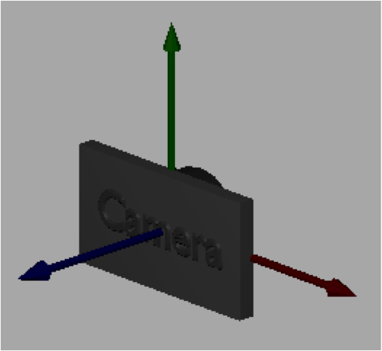
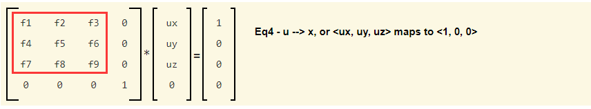
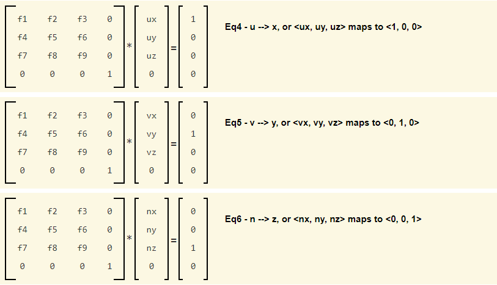
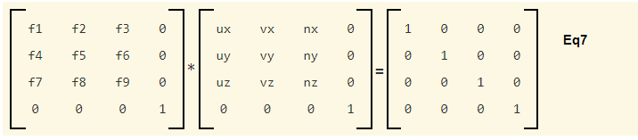
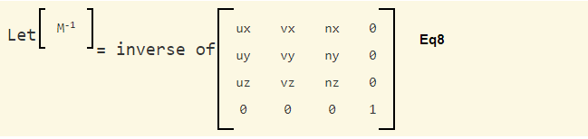
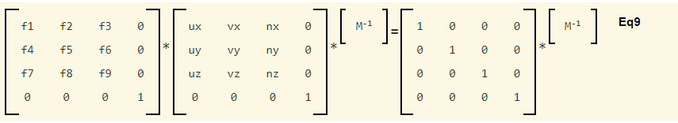
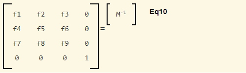
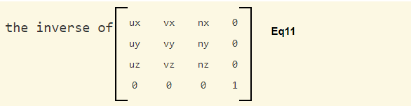
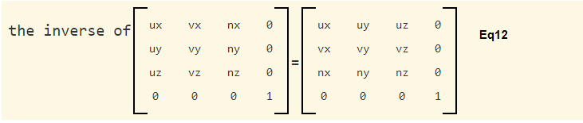

# 7.2 - Camera Math

就像我们在上一节课程中讨论的那样，在 WebGL 中，相机始终位于原点，向下看向 -Z 轴。程序员的工作是创建一个变换，将场景移动到这个静止的摄像机前。如果你了解这是如何完成的，你将能够执行更具创意的相机工作。本节课将解释相机变换后面的数学原理。让我们回顾一下相机是如何定义的。



## A Camera Definition

使用一个位置和一个局部坐标系来定义一个相机。我们通常将这个位置称为 "eye" 位置。相机的局部坐标系由三个正交轴 u、v 和 n 定义。如果相机位于原点向下看 -Z 轴，则 u 将与 x 轴对齐，v 将与 y 轴对齐，n 将与 z 轴对齐。如下：

```javascript
u --> x
v --> y
n --> z
```

我们可以使用定义一个全局点和三个向量的 12 个值来指定一个相机。

```javascript
eye = (eye_x, eye_y, eye_z)  // the location of the camera
u = <ux, uy, uz>             // points to the right of the camera
v = <vx, vy, vz>             // points up from the camera
n = <nx, ny, nz>             // points backwards; -n is the center of view
```

向量 u、v 和 n 定义了相对方向(relative directions)，因为它们指向与眼睛位置相关的方向。

## Moving a Camera to its Default Location and Orientation

给定一个相机的定义，如果我们可以开发一个将相机移动到全局原点并且让相机轴与全局轴对齐的变换，那么我们将这个变换应用到场景中的任何模型上。这将移动镜头前的场景！

使用两个单独的转换可以轻松完成此任务：
* 首先，将相机移动到原点。
* 其次，旋转相机以将相机的局部坐标系轴与全局轴对齐。

在矩阵格式中，我们有以下内容，其中第一个操作位于链式变换的右侧：

```
| rotateToAlign | * | translateToOrigin | * | x |   | x' |
                                            | y | = | y' |
                                            | z |   | z' |
                                            | w |   | w' |
```

`translateToOrigin` 变换很容易创建，因为我们知道眼睛的位置。这个变换是：

```
translateToOrigin = | 1 0 0 -eye_x |
                    | 0 1 0 -eye_y |
                    | 0 0 1 -eye_z |
                    | 0 0 0      1 |
```

`rotateToAlign` 变换同样简单。 （我们将在下面开发这个变换。）这个变换是：

```
translateToOrigin = | ux uy uz 0 |
                    | vx vy vz 0 |
                    | nx ny nz 0 |
                    |  0  0  0 1 |
```

因此，将相机移动到原点并对齐轴的转换是：

```
| ux uy uz 0 |   | 1 0 0 -eye_x |   | x' |
| vx vy vz 0 | * | 0 1 0 -eye_y | = | y' |
| nx ny nz 0 |   | 0 0 1 -eye_z |   | z' |
|  0  0  0 1 |   | 0 0 0      1 |   | w' |
```

通过单击乘号来执行矩阵数学！这是用于所有 3D 计算机图形的标准相机转换！ （实际上，适用于所有右手坐标系的 3D 计算机图形。）

## Deriving the Rotation Transform （推导旋转变换）

让我们仔细看看将相机轴与全局轴对齐的旋转矩阵。请记住，u 轴映射到全局 x 轴，v 轴映射到全局 y 轴，n 轴映射到全局 z 轴。还要记住，围绕任意轴的一般旋转需要变换矩阵左上角 3×3 （the upper-left 3-by-3）位置的部分数值。



因此，所需的旋转矩阵必须满足以下三个方程：



我们需要一个使所有三个方程都成立的变换。由于矩阵乘法的工作方式，可以将这三个独立的方程组合成一个方程，如下所示：



请注意，三个独立方程中的向量变成了单个矩阵的列。为了求解旋转矩阵，我们需要将方程两边乘以已知矩阵的逆矩阵。



于是



简化得



我们需要将相机的局部坐标系与全局坐标系对齐的旋转矩阵是：



数学家已经证明，如果矩阵的列是相互正交的向量，那么这种矩阵的逆矩阵就是它的转置 ([1](https://en.wikipedia.org/wiki/Orthogonal_matrix))。我们矩阵的列是正交的，因为它们定义了一个有效的右手坐标系，其中每个轴与其他两个轴成直角。因此，逆向是微不足道的——你交换行和列。



## `lookat` Implementation

下面是 `lookat` 函数的 JavaScript 实现。它只是实现了我们刚刚讨论的数学。请注意，变量 V、center、eye、up、u、v 和 n 是在创建 `Learn_webgl_matrix` 对象是只创建一次的类对象。这些对象在每次调用 `lookat` 时被重用。

```javascript
self.lookAt = function (M, eye_x, eye_y, eye_z, center_x, center_y, center_z, up_dx, up_dy, up_dz) {

  // Local coordinate system for the camera:
  //   u maps to the x-axis
  //   v maps to the y-axis
  //   n maps to the z-axis

  V.set(center, center_x, center_y, center_z);
  V.set(eye, eye_x, eye_y, eye_z);
  V.set(up, up_dx, up_dy, up_dz);

  V.subtract(n, eye, center);  // n = eye - center
  V.normalize(n);

  V.crossProduct(u, up, n);
  V.normalize(u);

  V.crossProduct(v, n, u);
  V.normalize(v);

  var tx = - V.dotProduct(u,eye);
  var ty = - V.dotProduct(v,eye);
  var tz = - V.dotProduct(n,eye);

  // Set the camera matrix
  M[0] = u[0];  M[4] = u[1];  M[8]  = u[2];  M[12] = tx;
  M[1] = v[0];  M[5] = v[1];  M[9]  = v[2];  M[13] = ty;
  M[2] = n[0];  M[6] = n[1];  M[10] = n[2];  M[14] = tz;
  M[3] = 0;     M[7] = 0;     M[11] = 0;     M[15] = 1;
};
```
