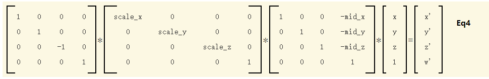
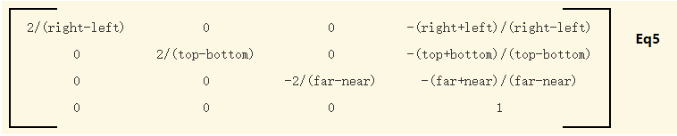

# 投影

三维对象最终需要在二维屏幕上进行绘制，这个过程叫投影。
<br/>
在WebGL中存在两种投影
1. 正射投影（Orthographic Projections）
2. 透视投影（Perspective Projections）

## 正射投影

1. [正射投影介绍](http://learnwebgl.brown37.net/08_projections/projections_ortho.html)<br/>

## 正射投影矩阵

三维的投影空间（裁剪空间）是一个2个单位宽的立方体<br/>


当进行渲染时，我们需要将画布的像素空间与投影空间进行转换。假设<br/>
left, right, up, bottom代表这画布的左右上下<br/>
near：沿着-z轴与裁剪平面的近点距离<br/>
up：沿着-z轴与裁剪平面的远点距离<br/>

所以,x，y，z三个坐标方向的中点为:<br/>

```javascript
mid_x = (left + right) / 2;
mid_y = (bottom + up) / 2;
mid_z = (-near + -far) / 2;
```

那么,这个立方体它的原点矩阵应该是<br/>

```
1, 0, 0, -mid_x
0, 1, 0, -mid_y
0, 0, 1, -mid_z
1, 0, 0,      1
```

然后是要将这个原点矩阵，缩放到单位空间中，上面已经说过，投影空间是一个2个单位宽的立方体，因此，要对x,y,z有个缩放矩阵，其中三个轴方向的缩放因子为：<br/>

```javascript
scale_x = 2.0 / (right - left);
scale_y = 2.0 / (up - bottom);
scale_z = 2.0 / (far - near);
```

则缩放矩阵为:

```
scale_x, 0,       0,       0
0,       scale_y, 0,       0
0,       0,       scale_z, 0
0,       0,       0,       1
```

接下来，要切换坐标系，**右手坐标系和左手坐标系之间的唯一区别是 z 轴的方向。通过将 z 分量乘以 -1，可以在两个系统之间切换顶点** (原文翻译)。<br/>

```
1,  0,  0,  0
0,  1,  0,  0
0,  0, -1,  0
0,  0,  0,  0
```

**从概念上讲，正交变换由这三个从右到左应用的顺序变换组成**（原文翻译)
<br/>
简化后可得<br/>
<br/>

## 示例

1. WebGL_Triangle_Orthographic
