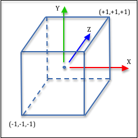

# 投影

三维对象最终需要在二维屏幕上进行绘制，这个过程叫投影。
<br/>
在WebGL中存在两种投影
1. 正射投影（Orthographic Projections）正射投影没有景象深度，因此可以用于工程方面精准表达模型。
1. 透视投影（Perspective Projections）透视投影则铀景象深度，用于表现“现实生活”中的场景。

## 裁剪

在虚拟场景中（计算机中），WebGL需要对场景中的对象进行**裁切**，来决定哪些部分可以显示在场景中，哪些部分不能显示在场景中。<br>

三维的投影空间（裁剪空间）是一个2个单位宽的立方体 -- Normalized Device Coordinates (NDC),它的x轴从-1到1，y轴从-1到1，z轴从-1到1<br/>
<br>

通过上图，你会发现**裁剪空间是左手坐标系统(left-handed coordinate system),而WebGL是右手坐标系统(right-handed coordinate system)**<br>

### 为什么是左手坐标系统?
> The short story is this: the hardware GPU that produces the graphics is designed for speed and efficiency, while the WebGL API is designed for programmers. Most people are right handed, so for most people the right-hand rule feels natural and comfortable, while the internal workings of the graphics hardware can typically be ignored. The projection matrix is the last operation under programmer control that manipulates the geometric data of a scene. So the projection transformation can convert to a left-handed coordinate system and not affect anything the programmer has done with the geometric data in a right-handed coordinate system.

总之：WebGL使用右手坐标系统，方便开发；裁切（由硬件执行），则是为了效率。<br>

Given that the clipping volume uses a left-handed coordinate system, there are two very important implications to the graphics programmer:

* You must always include a projection matrix in your vertex transform, even if you don’t think you need one. All of the transformations we have defined previously assumed a right-handed coordinate system. If you don’t include a projection matrix, all of the other transformation matrices will not work correctly.
* If you create your own projection matrix, it should negate the z values of all vertices.

> 作为程序员你需要保证两件事：
> 1. 在你的转换矩阵中要包含投影矩阵，无论你是否需要它。我们之前的转换都是基于右手坐标系统上。如果你没有包含投影矩阵，那么所有其他的转换都将不正确。
> 2. 如果你创建自己的投影矩阵，它应该将所有顶点的z值变成负数。

### 裁切
判断一个顶点在场景中是否可见，一般的逻辑如下：
```javascript
if (x >= -1 and x <= 1 and
    y >= -1 and y <= 1 and
    z >= -1 and z <= 1)
  point_is_visible = true;
else
  point_is_visible = false;
```
使用绝对值来简化一下公式：
```javascript
point_is_visible = (abs(x) <= 1 and abs(y) <= 1 and abs(z) <= 1)
```
Actually clipping is done in homogeneous coordinates（齐次方程） (which you will learn more about in a couple of lessons). For a (x,y,z,w) vertex, the clipping test would be
```javascript
point_is_visible = (abs(x) <= w and abs(y) <= w and abs(z) <= w)
```

### 何时进行投影变换?
当场景移动到虚拟相机的前面后，且还么有被裁剪前，就需要进行投影变换。公式如下：
```
VertexTransform = [ProjectionMatrix] * [ViewMatrix] * [ModelMatrix]
```

## Orthographic Projections（正射投影）

1. [正射投影介绍](http://learnwebgl.brown37.net/08_projections/projections_ortho.html)<br/>

> If the value of left is greater than the value of right, the world is mirrored about the Y axis. If the value of bottom is greater than the value of top, the world is mirror about the X axis. If you get the near and far values confused, clipping in depth will be backwards.

> * 当*left*大于*right*,则场景变成以y轴镜像；当*bottom*大于*top*,则场景变成以x轴镜像<br>
> * 观察窗(viewing window)是观察体(viewing volume)的正面,It is defined in the lower-left corner by the point (left, bottom, near) and in the upper-right corner by the point (right, top, near).

### 正射投影矩阵

> As we discussed in the previous lesson, a projection matrix must get the vertices in a scene into the clipping volume, which is a 2 unit wide cube shown in the image to the right. This is easily done with three transformations:

> 1. Translate the volume defined by the createOrthographic parameters so that it is centered at the origin, then
> 2. Scale the volume to be a 2 unit wide cube using an appropriate scale factor for each axis, and then
> 3. Flip the z axis to match the clipping space’s coordinate system.
```

当进行渲染时，我们需要将画布的像素空间与投影空间进行转换。假设<br/>
left, right, up, bottom代表这画布的左右上下<br/>
near：沿着-z轴与裁剪平面的近点距离<br/>
up：沿着-z轴与裁剪平面的远点距离<br/>

所以,x，y，z三个坐标方向的中点为:<br/>

```javascript
mid_x = (left + right) / 2;
mid_y = (bottom + up) / 2;
mid_z = (-near + -far) / 2;
```

那么,这个立方体它的**原点矩阵**应该是<br/>

```
centerAboutOrigin = | 1, 0, 0, -mid_x |
                    | 0, 1, 0, -mid_y |
                    | 0, 0, 1, -mid_z |
                    | 1, 0, 0,      1 |
```

然后是要将这个原点矩阵，缩放到单位空间中，上面已经说过，投影空间是一个2个单位宽的立方体，因此，要对x,y,z有个缩放矩阵，其中三个轴方向的缩放因子为：<br/>

```javascript
scale_x = 2.0 / (right - left);
scale_y = 2.0 / (up - bottom);
scale_z = 2.0 / (far - near);
```

则**缩放矩阵**为:

```
scaleViewingVolume = | scale_x, 0,       0,       0 |
                     | 0,       scale_y, 0,       0 |
                     | 0,       0,       scale_z, 0 |
                     | 0,       0,       0,       1 |
```

接下来，要切换坐标系，**右手坐标系和左手坐标系之间的唯一区别是 z 轴的方向。通过将 z 分量乘以 -1，可以在两个系统之间切换顶点** (原文翻译)。<br/>

```
convertToLeftHanded = | 1,  0,  0,  0 |
                      | 0,  1,  0,  0 |
                      | 0,  0, -1,  0 |
                      | 0,  0,  0,  0 |
```

**从概念上讲，正交变换由这三个从右到左应用的顺序变换组成**（原文翻译)
<br/>
简化后可得<br/>
<br/>

正交投影不会修改顶点的 (x,y) 值之间的相对关系，因此对象的大小不会随着它靠近或远离相机而改变。

### 示例

1. WebGL_Triangle_Orthographic

## 透视投影

### 透视投影的视锥体
透视投影定义了一个 3D 区域，该区域沿着四个边界射线从相机的位置投影出来。该区域称为视锥体，如下图:<br>
<br/>
这个视锥体包含两个平行于x-y平面的前切平面和后切平面.任何锥体内的模型都将被渲染，而锥体外的模型将被裁切。

### 定义视锥体
由两种方法来定义视锥体:
1. 函数`createPerspective()`模拟相机的尽头，相机处于全局原点向下看向-z轴.
2. 函数`createFrustum() `定义了一个平行于x-y平面的二维视窗。相机可以被放置在这个x-y平面的任何位置，但是总是向下看向-z轴。这个函数的常见用途是为一个场景渲染两个不同的视图，一个模拟用户的左眼，另一个模拟用户的右眼。如果两个视图正确的偏移渲染(If the two renderings are offset correctly)，并且分别显示到用户的眼睛中，用户就可以看到一个三维场景。这就是创建虚拟现实( virtual reality)的方式。

#### 第一种方式`createPerspective()`

函数的声明：

```
/** -----------------------------------------------------------------
 * Create a perspective projection matrix using a field-of-view and an aspect ratio.
 * @param fovy   Number The angle between the upper and lower sides of the viewing frustum.
 * @param aspect Number The aspect ratio of the viewing window. (width/height).
 * @param near   Number Distance to the near clipping plane along the -Z axis.
 * @param far    Number Distance to the far clipping plane along the -Z axis.
 * @return Float32Array The perspective transformation matrix.
 */
function createPerspective(fovy, aspect, near, far)
```

参照下图来解释各个参数的含义


1. fovy, 表示视野的y轴，即相机镜头的垂直角度
2. aspect, 纵横比，画布窗口的width/height
3. near、far, 距离(distances ),任何正数且near总是小于far。应该确保near与far间的距离足够小来降低精度问题，因为视锥体会被映射到一个2单元深的裁剪体中。
   通常near和far的值应该从0.1到100.0之间。就是说，near尽可能的远离相机，far则尽可能的靠近相机。

#### 第二种方式`createFrustum()`

函数声明：

```
/** -----------------------------------------------------------------
 * Set a perspective projection matrix based on limits of a frustum.
 * @param left   Number Farthest left on the x-axis
 * @param right  Number Farthest right on the x-axis
 * @param bottom Number Farthest down on the y-axis
 * @param top    Number Farthest up on the y-axis
 * @param near   Number Distance to the near clipping plane along the -Z axis
 * @param far    Number Distance to the far clipping plane along the -Z axis
 * @return Float32Array A perspective transformation matrix
 */
function createFrustum (left, right, bottom, top, near, far)
```

(left, bottom, near)和(right, top, near)定义了观察窗左下(lower-left)角和右上(upper-right)角。如果你计算观察窗的中点并将这个点映射到x-y面上，这个点就是锥体(观察体)的顶点。
从这个顶点通过观察窗的四个点投射光线形成截锥体。

效果：
1. createFrustum允许创建一个沿z轴偏离中心(off center)的截锥体，但是视域仍然平行z轴
2. 作为程序员，需要确保画布的长宽比(width/height)与视窗的长宽比((right-left) / (top-bottom))保持一致。如果长宽比不一致，则渲染的效果会出现歪斜。
3. 改变near的值会对截锥体有深远的影像，因为这是从相机到视窗的距离，而整个截锥体由视窗的叫定义。改变near从根本上改变了相机镜头的视野（由前面描述的 createPerspective 函数中的 fovy 参数控制）
4. 改变far只影响剪切
5. 改变left和right将相机从原点移开
6. 改变top和botton将相机从原点移开

### 透视投影矩阵(The Perspective Projection Matrix)

计算投影矩阵比正交矩阵更有挑战性，因为需要更多的计算技巧。

创建步骤如下：
1. 将截锥体移动到原点
2. 执行透视计算
3. 将视窗中的二维点 (x',y') 值缩放到 2×2 单位正方形中：(-1,-1) 到 (+1,+1)
4. 将深度值 (z) 缩放到归一化范围 (-1,+1)
5. 翻转 z 轴的方向以匹配剪切体积的方向

#### 第一步：将截锥体移动到原点

透视截锥体可以沿x轴和y轴从原点进行偏移。我们需要将视锥体的顶点置于全局原点，以便进行透视计算。顶点位于XY平面中视窗的中心。因此，我们计算视窗的中心点并将其平移到原点。请注意z值没有变化。

```
mid_x = (left + right) * 0.5;
mid_y = (bottom + top)  * 0.5;
```

平移矩阵为

```
| 1 0 0 -mid_x |
| 0 1 0 -mid_y |
| 0 0 1      0 |
| 0 0 0      1 |
```

#### 第二步：透视计算

我们需要将三维场景中的每一个顶点投影二维视窗中的正确位置上。二维视窗是截锥体的近点平面。参照下图：<br>


请注意，顶点 (x,y,z) 通过将光线投影到相机（显示为橙色光线）上而投影到视窗。顶点渲染的位置是(x',y',near)。从图中您可以看到 y 和 y' 的值通过成比例的直角三角形相关。
所以y'/near一定等于y/z。通过`(y/z)*near`或 `(y*near)/z`可以求解y'。请注意，对于特定场景，near是一个常数，而对于场景中的每个顶点，y 和 z 是不同的。
所有的x'计算逻辑是相同的：x' = (x*near)/z。

```
x' = (x*near)/z
y' = (y*near)/z
```

因为相机前面顶点的所有 z 值都是负的,所以

```
x' = (x*near)/(-z)
y' = (y*near)/(-z)
```

这里有个问题，4x4变换矩阵是各项的线性组合，我们可以执行这样的计算：`a*x + b*y + c*z + d`，但是不能执行顶点的x和z分量在单个项中的计算：`a*x/z + ...`。
但是我们可以使用齐次坐标的解决方案。<br>
记住(x,y,z,w)定义的顶点在三维空间中的位置为(x/w, y/w, z/w)
> Remember that a vertex defined as (x,y,z,w) defines a location in 3D space at the point (x/w, y/w, z/w). 

通常w的值等于1，所以 (x,y,z)就是(x,y,z)。但是为了实现透视除法，我们可以将w设置成除数(-z)
> Normally the w component is equal to 1 and the (x,y,z) values are exactly that, (x,y,z). But to implement perspective division we can set the w value to our divisor, (-z). 

这将上述计算分为两部分。矩阵变换将执行乘法。矩阵乘法之后的处理步骤将执行齐次除法。

为了在透视计算中执行乘法，我们可以使用这个矩阵变换:

```
| near 0    0 0 |   | x |
| 0    near 0 0 | * | y |
| 0    0    1 0 |   | z |
| 0    0    0 1 |   | w |
```

将 w 值设置成除数 (-z) ，我们可以使用以下变换矩阵：

```
| 1 0  0 0 |   | x |
| 0 1  0 0 | * | y |
| 0 0  1 0 |   | z |
| 0 0 -1 0 |   | w |
```

整理得:

```
| near 0     0 0 |   | x |
| 0    near  0 0 | * | y |
| 0    0     1 0 |   | z |
| 0    0    -1 0 |   | w |
```

**图形管道被设计成为除以w值，即(x,y,z) => （x/w,y/w,z/w),管道总是在将顶点的值传递到其余阶段之前计算 (x/w, y/w, z/w)**
> The graphics pipeline is designed to expect the perspective divisor in the w component. The pipeline always calculates (x/w, y/w, z/w) before passing a vertex’s values onto the remaining stages.

#### 第三步: Scale the View Window to (-1,1) to (+1,+1)

后续步骤要求将2D视窗归一化为 (-1,-1) 到 (1, 1) 之间的值，我们需要将 x 和 y 值缩放为 2×2 平方，使用缩放因子可以做到：2/currentSize。

```
scale_x = 2.0 / (right - left);
scale_y = 2.0 / (top - bottom);

| 2 / (right - left) 0                   0 0 |   | x |
| 0                  2 / (top - bottom)  0 0 | * | y |
| 0                  0                   1 0 |   | z |
| 0                  0                   1 0 |   | w |
```

#### 第四步: Mapping Depth (z values) to (-1,+1)

我们已经计算出了顶点在2D视窗中得正确位置，但是没有涉及修改z值。我们不能忽略z值，它表示顶点到相机得距离，用来决定对象得前后位置。我们可以容易得使用线性映射将 (-near,-far) 映射到 (-1,+1)区间。但是浮点数在操作得时候会出现舍入问题。在图形应用中，有时 0.1234568 和 0.1234567 之间的差异会对渲染产生视觉影响。我们应该对靠近相机的值使用更高的精度，对远离相机的值使用更低的精度。这就意味着我们将使用的是非线性的映射关系将 (-near,-far) 映射到 (-1,+1)区间。

我们使用的非线性方程为: c1/-z + c2，其中c1和c2是基于(-near, -far)计算出来的常量。当 z = -near 时，方程必须计算得 -1。当 z = -far 时，方程必须计算得 +1

```
-1 = c1/-(-near) + c2
+1 = c1/-(-far)  + c2
```

整理公式得：

```
c1 = 2*far*near / (near - far)
c2 = (far + near) / (far - near)
```
假设near = 2.0, far = 40, 这表示z值在-2到-40间的顶点将被包含在裁剪体中。下图就是将z值映射到(-1,1)区间内的对照表。<br>
<br>


请注意，-2 和 -3.8 之间的 z 值使用了一半的剪切量值 (-1.0, 0.0)！那绝对是非线性的！
> Notice that the z values between -2 and -3.8 use up half of the clipping volume values (-1.0, 0.0)! That is definitely non-linear!

等等，我们在执行透视计算时面临同样的问题，你不能将类似`c1/-z + c2`放置到变换矩阵中。所以我们使用与透视分割（透视除法）相同的方法，我们将除法步骤推迟到变换后的齐次除法后。<br>
我们可以将映射方程写成如下形式：
```
c1/-z + c2*(-z)/(-z) => (c1 + c2*(-z))/(-z)
```
整理一下：
```
(-c2*z + c1)/(-z)
```
我们可以将这个方程的顶部放在我们的矩阵变换中，然后让齐次除法处理除法。

```
| 1 0 0    0  |   | x |
| 0 1 0    0  | * | y |
| 0 0 -c2  c1 |   | z |
| 0 0 -1   0  |   | w |
```
请注意，我们需要在 w 仍为 1.0 时进行此变换。

#### 第五步: Switching Coordinate Systems

最后一步是转换 z 轴的方向以匹配裁剪体积方向。然而，我们不需要这样做，因为当我们将 z 值映射到非线性范围（从 -1 到 +1）时，已经将这个新范围切换到了 z 轴的方向。

### 构建透视投影变换

把以上介绍的公式进行整合，构成一个透视变换矩阵。我们列出了以下步骤，以便您可以将每个步骤与其单独的转换相匹配。然而，我们需要稍微修改一些东西来解释这些变换矩阵的组合。第2步和第3步都需要使w值等于(-z)。我们不希望做两边，所以我们删除了透视变换矩阵的-1项。另外，我们不需要交换坐标轴的方向，因为当我们将 z 值映射到 (-1,+1) 时，这些值在映射时被翻转了。
最后，我们重新排序深度值的缩放以确保它在 w 分量为 1.0 时执行。

1. 将截锥体的顶点平移到原点。（黄色矩阵）
2. 将深度值 (z) 缩放到归一化范围 (-1,+1)（并设置为除以 (-z)）。 (紫色矩阵)
3. 执行透视计算。 （灰色矩阵）
4. 将查看窗口中的 2D (x',y') 值缩放为 2×2 单位正方形； (-1,-1) 到 (+1,+1)。 （青色矩阵）


如果您简化矩阵项并替换 c1 和 c2 的方程，您将得到此变换


> You will probably never implement code to create a perspective projection. It has been implemented for you in the learn_wegbl_matrix.js code file. So what value was there in going through all of the above discussion? Many operations in computer graphics are performed by transformation matrices. If you can master the art of creating combinations of transformations, you can create amazing computer graphics programs. The previous discussion has hopefully helped you think in terms of chaining matrix transformations to achieve a particular goal.

## `createPerspective()`与`createFrustum()`的比较

相同点：
* 都创建透视变换矩阵

不同点：
* They require different parameters to define the frustum viewing volume.
* The createPerspective() function only allows the viewing frustum to be centered at the global origin.
* The createFrustum function allows the viewing frustum to be offset from the global origin along the X or Y axis.

为了演示函数的等效性，以下两个示例展示了如何使用一个函数来实现另一个函数。

```
function createPerspectiveUsingFrustum (fovy, aspect, near, far) {

  var top, bottom, left, right;

  top = near * Math.tan(toRadians(fovy)/2);
  bottom = -top;
  right = top * aspect;
  left = -right;

  return createFrustum(left, right, bottom, top, near, far);
}

function createFrustumUsingPerspective (left, right, bottom, top, near, far) {
  var fovy, aspect;

  fovy = 2 * toDegrees(Math.atan2(top, near));
  if (-left === right && -bottom === top ) {
    aspect = right / top; // width / height

    return createPerspective(fovy, aspect, near, far);
  }
}
```

从根本上说，透视投影会根据每个顶点到相机的距离来改变每个顶点的 x 和 y 值。它还准备用于顶点的裁剪。