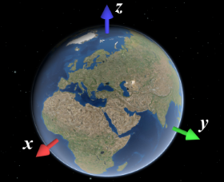
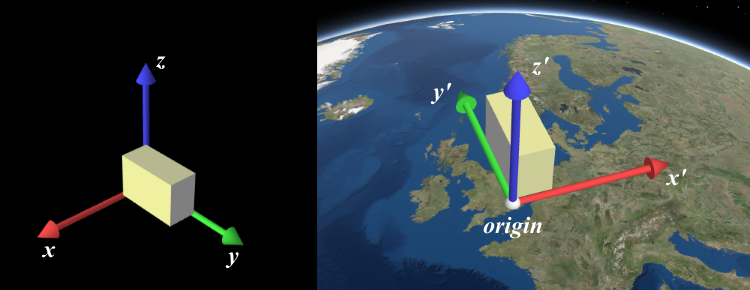

# Arcgis externalRenderers扩展例子说明

这个例子是参照arcgis js api 4.21中的例子修改而成，主要目的是为了学习如何在Arcgis js api中使用WebGL进行自定义渲染。

这个例子是使用自定义的三角体替代风车。

## 相关参考资料及代码

* [Extend the SceneView WebGL engine](https://developers.arcgis.com/javascript/latest/sample-code/scene-external-renderer/)
* ArcgisExternalRendererExample - 修改后的代码。

## externalRenderers对应的坐标参考

当使用 `external renderer` 的接口，特别是在WebGL上下文(context)中,坐标必须指定为 `SceneView` 的内部渲染坐标系的坐标。这个坐标系取决于视图的viewingMode：
* `local`, 它等于视图的空间参考定义的坐标系
* `global`, 它是一个 `ECEF（Earth-centered, Earth-fixed coordinate system）` 坐标系，其中 X 轴指向 0°N 0°E，Y 轴指向 0°N 90°E，Z 轴指向北极。虚拟地球绘制为半径为 6378137 的完美球体，因此坐标系的单位应考虑为米。



使用 toRenderCoordinates() 和 fromRenderCoordinates() 在渲染坐标系之间进行转换，而不必担心 viewingMode 和确切的坐标系定义。

## 代码说明

在代码目录里的代码只是将不用的代码进行了注释，但是在说明文档中，则只显示有效代码及说明。

## 代码

### shader

片段着色器采用单色渲染。

```javascript
<!-- A simple fragment shader -->
<script id="shader-fs" type="x-shader/x-fragment">
  precision mediump float;

  uniform vec4 v_Color;

  void main(void) {
    gl_FragColor = v_Color;
  }
</script>
```
顶点着色器传入四个参数分别是：
* aVertexPosition：模型
* uModelViewMatrix： 视域矩阵
* uProjectionMatrix: 投影矩阵
* v_Color: 颜色

```javascript
<!-- A simple vertex shader -->
<script id="shader-vs" type="x-shader/x-vertex">
  attribute vec3 aVertexPosition;
  uniform mat4 uModelViewMatrix;
  uniform mat4 uProjectionMatrix;

  uniform vec4 v_Color;

  void main(void) {
    gl_Position = uProjectionMatrix * uModelViewMatrix * vec4(aVertexPosition, 1.0);
  }
</script>
```


```javascript
/***********************************
 * Create an external renderer class
 **********************************/
const MyExternalRenderer = Accessor.createSubclass({
  // Input data
  wind: null,
  stations: null,
  view: null,

  // Number of stations to render
  numStations: null,

  // Local origin
  localOrigin: null,
  localOriginRender: null,

  // Vertex and index buffers
  vboBasePositions: null,
  iboBase: null,

  // Vertex and index data
  windmillBasePositions: null,
  windmillBaseIndices: null,

  // Shader
  program: null,

  // Shader attribute and uniform locations
  programAttribVertexPosition: null,
  programUniformProjectionMatrix: null,
  programUniformModelViewMatrix: null,

  colorLocation: null,

  // Per-instance data
  windmillInstanceTowerScale: null,
  windmillInstanceInputToRender: null,

  // Temporary matrices and vectors,
  // used to avoid allocating objects in each frame.
  tempMatrix4: new Float32Array(16),

  /**
   * Constructor
   */
  constructor: function (view, wind, stations) {
    this.view = view;
    this.wind = wind;
    this.stations = stations;
  },
```
在 `externalRenderers`中有两个重要的重载函数：
* `setup()`, 当 `external renderer` 加入到 `view` 后，这个函数会被调用一次。因此在此函数可以用户静态资源的申请等。
* `render()`，在每一帧中执行以将几何图形绘制到画布上：
  * 更新动态资源的状态
  * 根据需要设置 WebGL 状态以进行渲染
  * 发出 WebGL 绘制调用

```javascript
  /**
   * Called once after this external renderer is added to the scene.
   * This is part of the external renderer interface.
   */
  setup: function (context) {
    this.initShaders(context);
    this.initData(context, this.wind, this.stations);

    // cleanup
    context.resetWebGLState();
  },

  /**
   * Called each time the scene is rendered.
   * This is part of the external renderer interface.
   */
  render: function (context) {
    const gl = context.gl;
    const time = Date.now() / 1000.0;

    // Set some global WebGL state
    // State will be reset between each render() call
    gl.enable(gl.DEPTH_TEST);
    gl.disable(gl.CULL_FACE);
    gl.disable(gl.BLEND);

    // Enable our shader
    gl.useProgram(this.program);
    this.setCommonUniforms(context);

    // Draw all the bases (one draw call)
    this.bindWindmillBase(context);
```

```javascript
    // 单位矩阵
    glMatrix.mat4.identity(this.tempMatrix4);

    // Apply local origin by translation the view matrix by the local origin, this will
    // put the view origin (0, 0, 0) at the local origin
    glMatrix.mat4.translate(this.tempMatrix4, this.tempMatrix4, this.localOriginRender);

    // 加入地表图层后，三角体会被地表淹没，所以将所有三角体沿z轴上移。
    glMatrix.mat4.translate(this.tempMatrix4, this.tempMatrix4, [1, 1, 100]);

    glMatrix.mat4.multiply(this.tempMatrix4, context.camera.viewMatrix, this.tempMatrix4);
    gl.uniformMatrix4fv(this.programUniformModelViewMatrix, false, this.tempMatrix4);

    gl.drawElements(gl.TRIANGLES, this.windmillBaseIndices.length, gl.UNSIGNED_SHORT, 0);
  },

  /**
    * Loads a shader from a <script> html tag
    */
  getShader: function (gl, id) {
    const shaderScript = document.getElementById(id);
    if (!shaderScript) {
      return null;
    }

    let str = "";
    let k = shaderScript.firstChild;
    while (k) {
      if (k.nodeType == 3) {
        str += k.textContent;
      }
      k = k.nextSibling;
    }

    let shader;
    if (shaderScript.type == "x-shader/x-fragment") {
      shader = gl.createShader(gl.FRAGMENT_SHADER);
    } else if (shaderScript.type == "x-shader/x-vertex") {
      shader = gl.createShader(gl.VERTEX_SHADER);
    } else {
      return null;
    }

    gl.shaderSource(shader, str);
    gl.compileShader(shader);
    if (!gl.getShaderParameter(shader, gl.COMPILE_STATUS)) {
      alert(gl.getShaderInfoLog(shader));
      return null;
    }

    return shader;
  },

  /**
    * Links vertex and fragment shaders into a GLSL program
    */
  linkProgram: function (gl, fragmentShader, vertexShader) {
    const shaderProgram = gl.createProgram();

    gl.attachShader(shaderProgram, vertexShader);
    gl.attachShader(shaderProgram, fragmentShader);
    gl.linkProgram(shaderProgram);

    if (!gl.getProgramParameter(shaderProgram, gl.LINK_STATUS)) {
      return null;
    }

    return shaderProgram;
  },

  /**
    * Initializes all shaders requried by the application
    */
  initShaders: function (context) {
    const gl = context.gl;

    const fragmentShader = this.getShader(gl, "shader-fs");
    const vertexShader = this.getShader(gl, "shader-vs");
    this.program = this.linkProgram(gl, fragmentShader, vertexShader);
    if (!this.program) {
      alert("Could not initialise shaders");
    }

    gl.useProgram(this.program);

    // Program attributes
    this.programAttribVertexPosition = gl.getAttribLocation(this.program, "aVertexPosition");
    gl.enableVertexAttribArray(this.programAttribVertexPosition);

    // Program uniforms
    this.programUniformProjectionMatrix = gl.getUniformLocation(this.program, "uProjectionMatrix");
    this.programUniformModelViewMatrix = gl.getUniformLocation(this.program, "uModelViewMatrix");

    this.colorLocation = gl.getUniformLocation(this.program, "v_Color");
  },

  /**
    * Creates a vertex buffer from the given data.
    */
  createVertexBuffer: function (gl, data) {
    const buffer = gl.createBuffer();
    gl.bindBuffer(gl.ARRAY_BUFFER, buffer);

    // We have filled vertex buffers in 64bit precision,
    // convert to a format compatible with WebGL
    const float32Data = new Float32Array(data);

    gl.bufferData(gl.ARRAY_BUFFER, float32Data, gl.STATIC_DRAW);
    return buffer;
  },

  /**
    * Creates an index buffer from the given data.
    */
  createIndexBuffer: function (gl, data) {
    const buffer = gl.createBuffer();
    gl.bindBuffer(gl.ELEMENT_ARRAY_BUFFER, buffer);
    gl.bufferData(gl.ELEMENT_ARRAY_BUFFER, data, gl.STATIC_DRAW);
    return buffer;
  },

  /**
    * Initializes all windmill data
    *
    * General overview:
    * - We create a single vertex buffer with all the vertices of all windmill bases.
    *   This way we can render all the bases in a single draw call.
    * - Storing the vertices directly in render coordinates would introduce precision issues.
    *   We store them in the coordinate system of a local origin of our choice instead.
    * - We create a vertex buffer with the vertices of one set of windmill blades.
    *   Since the blades are animated, we render each set of blades with a different,
    *   time-dependent transformation.
    */
  initData: function (context, wind, stations) {
    const gl = context.gl;
    this.numStations = Math.min(stations.length, maxWindmills);
```
`externalRenderers.toRenderCoordinates` 的解释是，将位置从给定的空间参考转换成内部渲染坐标系。输入的空间参考有如下限制：
* `global` 下是Web Mercator 或 WGS84
* `local` 下，它必须与`view.spatialReference`匹配，该函数只是将坐标从 `srcCoordinates` 复制到 `destCoordinates`。

按照代码中的注释，局部原点选择的是map的中心点，然后调用 `externalRenderers.toRenderCoordinates` 对这个局部原点进行转换，转换成内部渲染坐标。

```javascript
    // Choose a local origin.
    // In our case, we simply use the map center.
    // For global scenes, you'll need multiple local origins.
    const localOriginSR = mapExtent.center.spatialReference;
    this.localOrigin = [mapExtent.center.x, mapExtent.center.y, 0];

    // Calculate local origin in render coordinates with 32bit precision
    this.localOriginRender = externalRenderers.toRenderCoordinates(
      view,
      this.localOrigin,
      0,
      localOriginSR,
      new Float32Array(3),
      0,
      1
    );
```

下面的代码是将从图层中读取的风车位置进行转换,将这些位置转换成渲染坐标系坐标。其中 [`externalRenderers.renderCoordinateTransformAt`](https://developers.arcgis.com/javascript/latest/api-reference/esri-views-3d-externalRenderers.html#toRenderCoordinates), 进行仿射变换矩阵计算，将一个线性坐标从本地笛卡尔积坐标系转成虚拟世界中的坐标系。

[*Affine Transformation是一种二维坐标到二维坐标之间的线性变换，保持二维图形的“平直性”（译注：straightness，即变换后直线还是直线不会打弯，圆弧还是圆弧）和“平行性”（译注：parallelness，其实是指保二维图形间的相对位置关系不变，平行线还是平行线，相交直线的交角不变。）。*](https://blog.csdn.net/weixin_39703698/article/details/80580562)



```javascript
    // Extract station data into flat arrays.
    this.windmillInstanceTowerScale = new Float32Array(this.numStations);
    this.windmillInstanceInputToRender = new Array(this.numStations);

    for (let i = 0; i < this.numStations; ++i) {
      const station = stations[i];
      const bladeLength = station.getAttribute("blade_l");
      const towerHeight = station.getAttribute("tower_h");

      // Offset and scale
      const towerScale = towerHeight / windmillHeight;
      this.windmillInstanceTowerScale[i] = 100;
      const bladeScale = bladeLength / windmillBladeSize;

      // Transformation from input to render coordinates.
      const inputSR = station.geometry.spatialReference;
      const point = [
        station.geometry.x,
        station.geometry.y,
        station.getAttribute("POINT_Z") || station.geometry.z
      ];
      const inputToRender = externalRenderers.renderCoordinateTransformAt(
        view,
        point,
        inputSR,
        new Float64Array(16)
      );
      this.windmillInstanceInputToRender[i] = inputToRender;
    }
```

构造三角体。在其他例子中，一般都是用的是 `gl.drawArrays()` 进行模型绘制，而这里使用的是 `gl.drawElements()`,他俩的区别是：
* `gl.drawArrays()`，直接按照顶点数组的数据进行绘制，进行多个相同模型绘制时，会有大量重复顶点的数据。
* `gl.drawElements()`，则是通过一个顶点索引来访问顶点数组中的数据进行绘制。

在下面的代码中，三角体的顶点数据保存在 `vertices4` 中，顶点索引保存在 `indicates`中。

```javascript
    var vertices = [
      [ 0.0, -0.25, -0.50],
      [ 0.0,  0.25,  0.00],
      [ 0.5, -0.25,  0.25],
      [-0.5, -0.25,  0.25]
    ];
    var number_triangles = 4;
    var number_vertices = number_triangles * 3;

    var indicates = new Uint16Array([2, 1, 3, 3, 1, 0, 0, 1, 2, 0, 2, 3]);

    this.windmillBasePositions = new Float64Array(this.numStations * number_vertices * 3);
    this.windmillBaseIndices = new Uint16Array(this.numStations * indicates.length);

    var vertices4 = new Float32Array(number_vertices * 3);

    var nv = 0;
    for (let z = 0; z < 3; z++) {
      for (let i = 0; i < vertices.length; i++) {
        var points = vertices[i];
        for (let j = 0; j < 3; j++, nv += 1) {
          vertices4[nv] = points[j];
        }
      }
    }
```
然后重复的将构造好的三角体按照每个风车比例进行缩放，分别保存到 `this.windmillBasePositions` 当中，此时的 `this.windmillBasePositions` 中保存的应该是所有三角体（每个风车对应一个）的顶点。

```javascript
    for (let i = 0; i < this.numStations; i++) {
      const positionMatrix = new Float64Array(16);
      glMatrix.mat4.identity(positionMatrix);
      glMatrix.mat4.multiply(positionMatrix, this.windmillInstanceInputToRender[i], positionMatrix);

      const numCoordinates = vertices4.length;
      const numVertices = numCoordinates / 3;
```

一般的向量缩放公式如下：
```javascript
self.scale = function (result, v0, s) {
    result[0] = v0[0] * s;
    result[1] = v0[1] * s;
    result[2] = v0[2] * s;
  };
```
在本例中，因为所有的向量都保存在 `this.windmillBasePositions` 这个一维数组中，所以可以根据每个风车的缩放值来缩放该风车对应的向量。

```javascript
      for (let j = 0; j < numCoordinates; ++j) {
        this.windmillBasePositions[i * numCoordinates + j] = vertices4[j] * this.windmillInstanceTowerScale[i];
      }
```

接下来就将对这些顶点进行坐标转换

```javascript
      // Transform vertices into render coordinates
      glMatrix.vec3.forEach(
        this.windmillBasePositions,
        0,
        i * numCoordinates,
        numVertices,
        glMatrix.vec3.transformMat4,
        positionMatrix
      );
```
**这里不是太明白, 为什么要减去局部原点？**
```javascript
      // Subtract local origin coordinates
      glMatrix.vec3.forEach(
        this.windmillBasePositions,
        0,
        i * numCoordinates,
        numVertices,
        glMatrix.vec3.subtract,
        this.localOriginRender
      );
```
将每个三角体的渲染索引复制到 `this.windmillBaseIndices` 当中。

```javascript
      const numIndices = indicates.length;
      for (let j = 0; j < numIndices; ++j) {
        this.windmillBaseIndices[i * numIndices + j] = indicates[j] + i * numVertices;
      }
    }

    // Upload our data to WebGL
    this.vboBasePositions = this.createVertexBuffer(gl, this.windmillBasePositions);
    this.iboBase = this.createIndexBuffer(gl, this.windmillBaseIndices);
  },

  /**
    * Activates vertex attributes for the drawing of the windmill base.
    */
  bindWindmillBase: function (context) {
    const gl = context.gl;

    gl.bindBuffer(gl.ARRAY_BUFFER, this.vboBasePositions);
    gl.enableVertexAttribArray(this.programAttribVertexPosition);
    gl.vertexAttribPointer(this.programAttribVertexPosition, 3, gl.FLOAT, false, 0, 0);

    gl.bindBuffer(gl.ELEMENT_ARRAY_BUFFER, this.iboBase);
  },
```
`this.programUniformProjectionMatrix` 对应的是顶点着色器中的 `uProjectionMatrix` 变量，即投影矩阵，它的值取自 `context.camera.projectionMatrix`。

```javascript
  /**
    * Sets common shader uniforms
    */
  setCommonUniforms: function (context) {
    const gl = context.gl;
    const camera = context.camera;

    gl.uniformMatrix4fv(this.programUniformProjectionMatrix, false, context.camera.projectionMatrix);

    var color_array = new Float32Array([1.0, 0.0, 0.0, 1.0]);
    gl.uniform4fv(this.colorLocation, color_array);
  }
});
```
