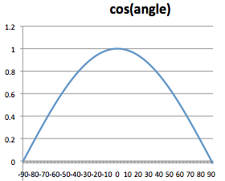
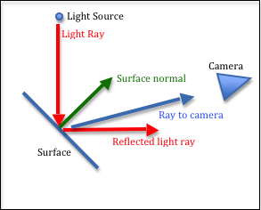

# 光线建模

要模拟对象在现实世界中的外观，你必须模拟光如何与对象的表面相互作用。当光线照射到物体时，以下四种情况中的一种或多种就会发生：

* 光线反射和逃离方向并不相同。反射光的方向由面部的表面特性决定
* 光被物体吸收并转化为能量，随着时间的推移加热物体。 （这称为吸收。）
* 光穿过物体并继续前进，但轨迹不同。 （穿过物体的光称为透明度，方向的变化称为折射。）
* 光进入物体，在物体内部反弹，然后在与它进入位置的不同位置离开物体。 （这称为次表面散射。）

对所有这些交互进行建模既复杂又困难。者可以做到，但是超出了这个基础教程的范围。我们这里只讨论光线如何从物体表面进行反射。
你不可能仅仅使用反射来生成真实的图像，但在尝试更复杂的建模之前，您需要了解基础知识

## 光源
In the real world light comes from light sources. The sun is the most obvious light source. Other light sources include lamps, spot lights, fire and explosions. The characteristics of light changes based on its source. We need to model some of these basic properties of light if we hope to get reasonable renderings. We will model the following properties of a light source:

* Position - where is the light coming from? There are two scenarios:
    * Directional - The light source is so far away that all light rays are basically traveling in the same direction. The sun is a directional light source.
    * Positional - The light source is inside the scene. The angle that light strikes an object changes based on their relative position. Note that the angle the light strikes individual vertices of an individual triangle will be different.
    > 光源在场景的内部。光线照射物体的角度根据它们的相对位置而变化。请注意，光线照射到单个三角形的各个顶点的角度会有所不同。
* Color - for example, a red spot light.
* Point vs Spotlight - does the light travel in all directions, or is the light restricted to a specific direction, such as flashlight.
  > 光是向各个方向传播，还是仅限于某个特定方向，例如手电筒。

Since light can have different colors, we model light in the same way we model surface color using a RGB value. A red light would be (1.0, 0.0, 0.0) while a white light would be (1.0, 1.0, 1.0).

## 环境反射光(Ambient Reflected Light)

Sometimes you don’t know the source of the light in a scene. For example, think about being in a dark room. You can see things, but you don’t necessarily know where the light in the room is coming from. It might be coming from the moon through a window, or from a light in another room under a doorway, or the faint glow of a night light. Light that is not coming directly from a light source, but is just bouncing around in a scene, is called ambient light.

> 有的时候你不知道场景里的光源。比如，在一个漆黑的房间里，你可以看到物体，但是你不需要知道光是从房间的什么地方来的。有可能是从窗户照射进来的月光，或者从门口从其他房间照射进来的光，抑或是来自夜灯的微弱光芒。不是直接从一个光源来的光线，而是从场景中反射的光，称为环境光。

Ambient light is “background” light. It bounces everywhere in all directions and has no specific location of origin. Ambient light illuminates every face of a model. Therefore, both the faces that get direct light, and the faces hidden from direct light are illuminated with the same amount of ambient light.

> 环境光是“背景”光。它向四面八方到处反弹，没有特定的起源位置。因此，被直射光照射的表面和隐藏在直射光下的表面，都被相同数量的环境光照亮。

The amount of ambient light determines the overall light in a scene. An ambient light of (0.1, 0.1, 0.1) would model a dark room, while an ambient light of (0.4, 0.4, 0.4) would model a well lit room. An ambient light of (0.2, 0.0, 0.0) would simulate a low intensity red light permeating a scene. The exact values you use will typically be based more on experimental results than on actual physical properties of a scene.

> 环境光的量决定了场景中的整体光。(0.1, 0.1, 0.1) 的环境光会模拟一个暗室，而 (0.4, 0.4, 0.4) 的环境光会模拟一个光线充足的房间。(0.2, 0.0, 0.0) 的环境光将模拟低强度红光弥漫在场景中。这些值通常更多地基于实验结果，而不是场景的实际物理属性。

## 漫反射光(Diffuse Reflected Light)

The amount of light that is reflected off of the surface of an object is related to the orientation of the surface to the light source. If light hits the surface “straight on”, most of the light will be reflected. If light just “grazes off” the side of an object, then very little light is reflected. This is illustrated in the diagram.

> 从物体表面反射的光量与表面相对于光源的方向有关。如果光线“直接”照射到表面，大部分光线将被反射。如果光只是从物体的一侧“擦掉”，那么反射的光就很少。图中说明了这一点。 

We assume that the surface of a face is not perfectly smooth and that the light scatters equally in all directions when it reflects off the surface. For diffuse light the question is how much reflection occurs, not the direction of the reflection. In Physics, Lambert’s cosine law gives us the amount of reflection.

If we take the cosine of the angle between the surface normal vector and the light ray, this gives us the amount of reflected light. When the angle is zero, cos(0) is 1.0 and all the light is reflected. When the angle is 90 degrees, cos(90) is 0.0 and no light is reflected. If the cos() is negative, the face is orientated away from the light source and no light is reflected. The amount of reflected light is not a linear relationship, as you can see in the plot of the cosine function in the image.

> 如果我们取表面法向量和光线之间夹角的余弦值，就可以得到反射光的数量。当角度为零时，cos(0) 为 1.0，所有光都被反射。当角度为 90 度时，cos(90) 为 0.0 并且没有光被反射。如果 cos() 为负，则面的方向远离光源并且没有光反射。反射光的量不是线性关系，正如在下图中的余弦函数图中看到的那样。

If you multiply the color of a surface by the cosine of the angle between the surface normal and light ray, you will scale the color towards black. This is exactly the results we want. As less and less light reflects off of a surface, the surface becomes darker.

> 如果将表面的颜色乘以表面法线和光线之间夹角的余弦值，则会将颜色缩放为黑色。这正是我们想要的结果。随着从表面反射的光越来越少，表面变得更暗。

## 镜面反射光(Specular Reflected Light)

If an object is smooth, some of the light reflected off of the surface of an object can be reflected directly into the viewer’s eye (or the camera’s lens). This creates a “specular highlight” that is the color of the light source, not the color of the object, because you are actually seeing the light source light. Each of the white areas on the blue balls in the image is a specular highlight.

The location of a specular highlight is determined by the angle between a ray from the viewer to the point on the surface, and the exact reflection of the light ray. The surface normal is used to calculate the reflected light ray. Please study the diagram below.

> 镜面高光的位置由从观察者视线到表面点和光线的精确反射光线间的角度决定。表面法线用于计算反射光线。请研究下图。

 
Specular highlight (Angle between reflected ray and ray to camera.)

## WebGL Implementation

All lighting effects in WebGL are done by the programmer in a fragment shader. To implement the three lighting effect described above, you would do the following:
* Get the amount of ambient light from a light source model.
* Calculate the angle between the surface normal vector and the light direction.
* Multiply the cosine of the angle times the surface’s diffuse color.
* Calculate the angle between the light reflection and the camera direction.
* Multiply the cosine of the angle times the light model’s specular color.
* Add the ambient, diffuse, and specular colors. This is the color of the pixel for this fragment of the triangle’s surface.
