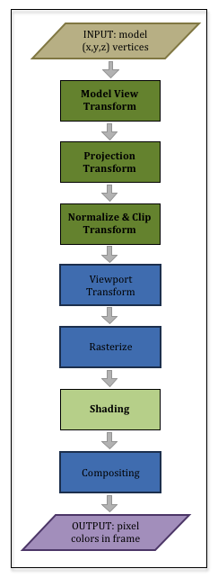

# 模型变换

## 参考资料
1. [Learn WebGL](http://learnwebgl.brown37.net/)

## 代码
1. WebGL_robot_arms<br>
    绘制机械臂底座
2. WebGL_robot_forearm<br>
    绘制机械臂大臂与底座
3. WebGL_robot_upperarm<br>
    绘制机械臂上臂、大臂与底座

代码均参照[Learn WebGL](ttp://learnwebgl.brown37.net/)进行编写。

## 前三个变换
三维图形渲染过程如下图：<br>


1. Model View Transform:This is actually two separate and distinct operations：<br>
    * Model Transform: Transform a model into it’s correct size, location, and orientation
    * View Transform: Transform a model into the correct location and orientation in front of the scene’s camera
2. Projection Transform: Transform a model to *project it* from 3-dimensional space onto a 2-dimensional viewing window.
3. Normalize and Clip Transform: Transform a model so that it can be easily discarded if it is not in the view frame of the scene’s camera.<br>
   (This is called “clipping” because one part of a model might be visible, while another part might not be.)

所以，一个通用的渲染公式为：<br>
VertexTransform = [ProjectionMatrix] * [ViewMatrix] * [ModelMatrix]

### 三个部件的变换
1. __底座__<br>
代码：WebGL_robot_arms<br>

以下代码位于index.html中<br>

```javascript
var matrix = new webgl_matrix();
var view = matrix.create();
var base_y_rotate = matrix.create();
var transform = matrix.create();
var projection = matrix.createOrthographic(-8, 8, -8, 8, -8, 8);

var base_x_rotate = matrix.create();

var base_y_angle = 0.0;

matrix.xRotation(view, 80);

matrix.xRotation(base_x_rotate, 90);
matrix.yRotation(base_y_rotate, base_y_angle);

// 底座变换矩阵
matrix.multiplySeries(transform, projection, view, base_x_rotate, base_y_rotate);
```

2. __大臂__<br>
代码：WebGL_robot_forearm<br>

以下代码位于load_model.js中<br>

```javascript
var matrix = new webgl_matrix();
var view = matrix.create();
var base_y_rotate = matrix.create();
var transform = matrix.create();
var projection = matrix.createOrthographic(-10, 10, -2, 18, -20, 20);
var forearm_rotate = matrix.create();
var forearm_translate = matrix.create();
var forearm_angle = 0.0;

var base_x_rotate = matrix.create();

var base_y_angle = 30;

matrix.xRotation(view, 80);

matrix.xRotation(base_x_rotate, 90);
matrix.yRotation(base_y_rotate, base_y_angle);

// 底座变换矩阵
matrix.multiplySeries(transform, projection, view, base_x_rotate, base_y_rotate);

// Create a Scene object which does all the rendering and events
scene = new window['webgl_render'](gl, program, model_dictionary.Base);
scene.render(transform);

matrix.translate(forearm_translate, 0, 2, 0);
matrix.zRotation(forearm_rotate, forearm_angle);
// 大臂变换矩阵
matrix.multiplySeries(transform, projection, view, base_x_rotate, base_y_rotate, forearm_translate, forearm_rotate);

scene1 = new window['webgl_render'](gl, program, model_dictionary.Forearm);
scene1.render(transform);
```

大臂的变换公式为：<br>
VertexTransform = [baseRotation] * [translateToPin] * [rotateForearm]

3. __上臂__<br>
代码：WebGL_robot_upperarm<br>

以下代码位于load_model.js中<br>

```javascript
var matrix = new webgl_matrix();
var view = matrix.create();
var base_y_rotate = matrix.create();
var transform = matrix.create();
var projection = matrix.createOrthographic(-10, 10, -2, 18, -20, 20);
var forearm_rotate = matrix.create();
var forearm_translate = matrix.create();
var upperarm_rotate = matrix.create();
var upperarm_translate = matrix.create();

var forearm_angle = 0.0;
var upperarm_angle = 0.0;

var base_x_rotate = matrix.create();

var base_y_angle = 30;

matrix.xRotation(view, 80);

matrix.xRotation(base_x_rotate, 90);
matrix.yRotation(base_y_rotate, base_y_angle);

// 底座变换矩阵
matrix.multiplySeries(transform, projection, view, base_x_rotate, base_y_rotate);

// Create a Scene object which does all the rendering and events
scene = new window['webgl_render'](gl, program, model_dictionary.Base);
scene.render(transform);

matrix.translate(forearm_translate, 0, 2, 0);
matrix.zRotation(forearm_rotate, forearm_angle);
// 大臂变换矩阵
matrix.multiplySeries(transform, projection, view, base_x_rotate, base_y_rotate, forearm_translate, forearm_rotate);

scene1 = new window['webgl_render'](gl, program, model_dictionary.Forearm);
scene1.render(transform);

matrix.translate(upperarm_translate, 0, 8, 0);
matrix.zRotation(upperarm_rotate, upperarm_angle);
// 上臂变换矩阵
matrix.multiplySeries(transform, projection, view, base_x_rotate, base_y_rotate,
  forearm_translate, forearm_rotate, upperarm_translate, upperarm_rotate);

scene2 = new window['webgl_render'](gl, program, model_dictionary.Upperarm);
scene2.render(transform);
```

上臂的变换公式为：<br>
modelTransform  = [baseRotation] * [translateToPin] * [rotateForearm] * [translateToForearmEnd] * [rotateUpperarm]

所以，三个部件渲染时的公式总结见[Chaining Transformations (Summary)](http://learnwebgl.brown37.net/transformations2/transformations_example4.html)