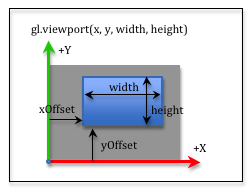
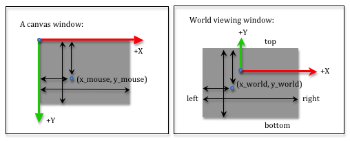
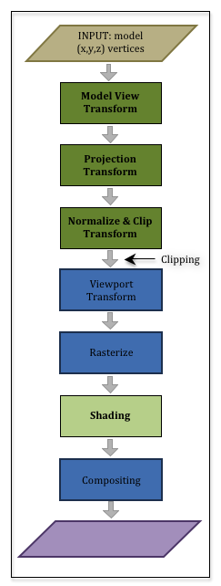

# 视角(viewport)

模型经过投影转换后，就可以被裁切，裁切将把不在相机视域中的元素（点，线，面）丢弃。经过裁切后，将创建2D图像。

## 视角变换(The Viewport Transformation)

具有(x,y,z)的几何体位于以原点为中心的2x2x2的裁剪体中。此时，应该可以创建2D图像。这个图像会被映射到HTML的画布(canvas)上,图像的大小(in pixels)与画布相同。<br>
WebGL影像使用的坐标系统是原点位于左下角(lower-left corner),正向x轴向右，正向Y轴向上，见下图:


在裁切体中的顶点需要被映射到图像中相应的位置上。这需要两个简单的变换：
1. 将 (-1,-1) 到 (+1,+1) 视窗缩放到与图像的宽度和高度相同
2. Offset the lower-left corner at (-width/2,-height/2) to the image’s origin

转换矩阵
```
| 1 0 0 width/2  |   | width/2    0     0 0 |   | x |   | xImage |
| 0 1 0 height/2 | * |    0    height/2 0 0 | * | y | = | yImage |
| 0 0 1    0     |   |    0       0     1 0 |   | z |   | zImage |
| 0 0 0    1     |   |    0       0     0 1 |   | 1 |   |    1   |
```
需要注意的是公式只针对x和y的变化，因为我们创建的是2D图像。z 分量与顶点一起携带，但其值保持不变。<br>

你不需要实现视角转换，这些都是由WebGL内部实现的。但是您可以指定您希望渲染填充画布的部分。默认情况下视角的长宽与画布的长宽是一样的。<br>
如果你希望渲染一个小的图像，你可以使用`gl.viewport(x_offset,y_offset,width,height)`来指定这个图像的偏移量和大小。<br>



x_offset,y_offset指定的是图像从左下角的偏移量，width,height指定的是图像的大小。公式如下：<br>

```
| 1 0 0 x_offset |   | 1 0 0 width/2  |   | width/2    0     0 0 |   | x |   | xImage |
| 0 1 0 y_offset | * | 0 1 0 height/2 | * |    0    height/2 0 0 | * | y | = | yImage |
| 0 0 1    0     |   | 0 0 1    0     |   |    0       0     1 0 |   | z |   | zImage |
| 0 0 0    1     |   | 0 0 0    1     |   |    0       0     0 1 |   | 1 |   |    1   |
```

## 屏幕鼠标位置与场景鼠标位置的推导(Mouse Events into World Locations)

有时候你需要将鼠标的位置转换成3D虚拟场景中的位置。由于你看到的是一个 3D 世界，因此鼠标位置实际上标识了无数点，这些点位于从相机通过鼠标位置进入 3D 世界的射线上。
您可以使用简单的比例（proportions）将鼠标位置转换为视窗中的位置。



**例子(略)**

鼠标使用的屏幕坐标是正向Y轴向下，但是，如果在你的比例（proportions）中使用相同的距离，这并不重要。在上图中，我们测量了左侧和上侧的距离。
我们使用用于定义投影矩阵的变量 left、right、bottom 和 top 来描述世界观察窗口。让我们使用 canvas_width 和 canvas_height 来描述画布窗口的大小。
两个窗口中的相对距离必须相同。所以：

```
x_mouse / canvas_width  === (x_world - left) / (right - left)
y_mouse / canvas_height === (top - y_world)  / (top - bottom)
```

如果您知道鼠标位置，(x_mouse, y_mouse)，您可以求解上面的方程来计算虚拟世界中视窗上的等效位置。那是：

```
x_world = [(x_mouse / canvas_width) * (right - left)] + left;
y_world = top - [(y_mouse / canvas_height) * (top - bottom)];
```

如果要将视窗中的位置转换为鼠标位置，可以求解得到以下方程：

```
x_mouse = [(x_world - left) / (right - left)] * canvas_width;
y_mouse = [(top - y_world)  / (top - bottom)] * canvas_height;
```

# Summary of Projections and Viewports

## A Graphics Pipeline Review

要了解计算机图形，您必须了解图形管道。让我们再次回顾一下图形管道。<br>

<br>

你有一组模型，你要将它们渲染到虚拟场景中。这些模型包含两种基本类型的数据：
1. Geometric data composed of vertices, (x,y,z), and normal vectors, <dx,dy,dz>, and
2. Material properties data such as colors, texture coordinates, shininess coefficients, etc..

这些数据通过图形管道用以创建场景的 2D 图像。上半部分的管道负责处理几何数据，下半部分的管道负责处理材质数据。

在头三个步骤中：
1. 模型转换：The geometric data is transformed using a 4-by-4 transformation matrix to place the geometry of the model in its desired location, orientation, and size. This is referred to as the “model transform.”
2. 视窗转换： The geometric data is transformed using a 4-by-4 transformation matrix to place the scene in front of the camera. This is referred to as the “view transform” (or the “camera transform”).
3. 投影转换：The geometric data is projected onto a 2D viewing window. This is referred to as the “projection transform.”

所有这些变换都发生在顶点着色器(vertex shader)中。 你在 JavaScript 程序中创建所需的变换矩阵，然后在 GPU 上运行的顶点着色器程序，来执行实际的几何数据变换。 大多数 WebGL 程序将所有这些转换组合成一个 4×4 转换矩阵，其中转换的顺序从右到左的是至关重要的，因为模型转换必须首先发生，然后是视图转换，最后是投影转换。

```
VertexTransform = [ProjectionMatrix] * [ViewMatrix] * [ModelMatrix]
```

> Your geometric data has been transformed into the clipping volume – a 2x2x2 cube centered at the origin. All geometry outside this cube is clipped away. Now the pipeline starts to create a 2D image by mapped the vertices into a 2D array of pixels that is the same size as its associated HTML canvas element. This is referred to as the “viewport transform.”

> The geometry data is now positioned in the correct place to create a 2D image. But all of these transformations have only been done on the vertices of the points, lines and triangles that compose your models. All of the pixels that compose a primitive object have not been determined. That is the next step in the pipeline and it is called the “rasterization” (or rasterisation) stage.

## 栅格化(Rasterize)

> To rasterize means to convert vector based descriptions of a geometric object into a set of pixels. For example, if we know the pixel locations of three vertices that define a triangle, to rasterize the triangle means we determine which pixels lie inside the boundaries formed by the triangle’s vertices and edges. The rasterization stage of the pipeline is done automatically.<br>

> For each pixel that is used to compose a primitive object, a “fragment” is created. A fragment knows its pixel location and other information that might be needed to assign the pixel a color. Each “fragment” that is created is passed through a fragment shader executing on the GPU. A fragment shader program performs calculations that assign an appropriate color to its pixel.<br>

> The remainder of these tutorials will discuss how a fragment shader calculates the color of a pixel.<br>